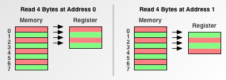
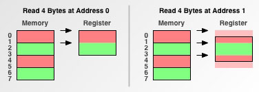

== Data Alignment

_Extraido de http://www.ibm.com/developerworks/library/pa-dalign/[IBM developerWorks]_

Data alignment is an important issue for all programmers who directly use memory. Data alignment affects how well your software performs, and even if your software runs at all. As this article illustrates, understanding the nature of alignment can also explain some of the "weird" behaviors of some processors.

== Memory access granularity

Programmers are conditioned to think of memory as a simple array of bytes. Among C and its descendants, char* is ubiquitous as meaning "a block of memory", and even Java™ has its byte[] type to represent raw memory.

image::images/data_alignment/001.jpg[]

However, your computer's processor does not read from and write to memory in byte-sized chunks. Instead, it accesses memory in two-, four-, eight- 16- or even 32-byte chunks. We'll call the size in which a processor accesses memory its memory access granularity.

image::images/data_alignment/002.jpg[]

The difference between how high-level programmers think of memory and how modern processors actually work with memory raises interesting issues that this article explores.
If you don't understand and address alignment issues in your software, the following scenarios, in increasing order of severity, are all possible:

* Your software will run slower.
* Your application will lock up.
* Your operating system will crash.
* Your software will silently fail, yielding incorrect results.

---

== Alignment fundamentals

To illustrate the principles behind alignment, examine a constant task, and how it's affected by a processor's memory access granularity. The task is simple: first read four bytes from address 0 into the processor's register. Then read four bytes from address 1 into the same register. +
First examine what would happen on a processor with a one-byte memory access granularity:

This fits in with the naive programmer's model of how memory works: it takes the same four memory accesses to read from address 0 as it does from address 1. Now see what would happen on a processor with two-byte granularity, like the original 68000:

When reading from address 0, a processor with two-byte granularity takes half the number of memory accesses as a processor with one-byte granularity. Because each memory access entails a fixed amount overhead, minimizing the number of accesses can really help performance.
However, notice what happens when reading from address 1. Because the address doesn't fall evenly on the processor's memory access boundary, the processor has extra work to do. Such an address is known as an unaligned address. Because address 1 is unaligned, a processor with two-byte granularity must perform an extra memory access, slowing down the operation.
Finally, examine what would happen on a processor with four-byte memory access granularity, like the 68030 or PowerPC® 601:

image::images/data_alignment/005.jpg[]

A processor with four-byte granularity can slurp up four bytes from an aligned address with one read. Also note that reading from an unaligned address doubles the access count.
Now that you understand the fundamentals behind aligned data access, you can explore some of the issues related to alignment.
