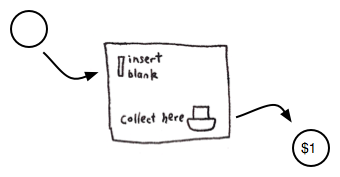
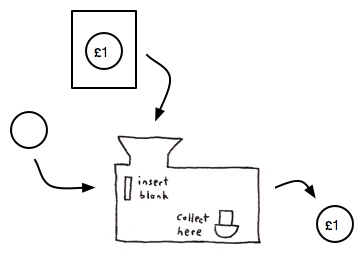
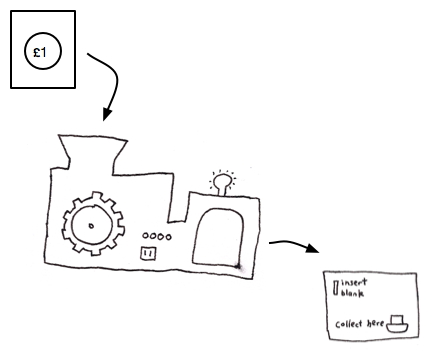

= Futamura Projections

_Extraido del blog http://blog.sigfpe.com/2009/05/three-projections-of-doctor-futamura.html[A Neighborhood of Infinity]_

== Introduccion

El Doctor Yoshihiko Futamura definio tres proyecciones, las cuales son una secuencia de aplicaciones de una tecnica de programacion llamada "partial evaluation" o "specialisation", cada una mas compleja que la anterior. Dado que no solo los programadores deberian tener toda la diversion, vamos a intentar explicar las tres proyecciones de una forma que cualquier persona podria entenderlo. De todos modos este tipo de rasonacimiento puede lastimar tu cerebro al menos lastimo el mio, pero es un lindo dolor, no?

En lugar de hablar de programas de computadoras vamos a hablar de simples maquinas. Estas maquinas tendran algunos slots usados como input y otro slot como output, vamos a asumir que estas maquinas pueden replicar objetos y que tenemos materiales infinitos, en una computadora podemos hacer copias de datos hasta que nos quedamos sin memoria.

== Acuñacion de monedas (Minting coins)

Un ejemplo simple de una maquina que tiene un solo slot de input para monedas en blanco y un slot de output que emite monedas con una denominacion especifica:

Esta es una maquina dedica para emitir monedas de $1. Podemos imaginar que internamente marca la moneda con la denominacion correspondiente.

Seria mas interesante si pudieramos crear una maquina nueva que tenga un slot adicional que nos permita ingresar la denominacion de la moneda. Si proveemos distintas denominaciones podriamos generar diferentes monedas con una sola maquina.

La misma maquina podria producir dolares, yen o reales. Podemos imaginar que esta maquina funciona tomando la denominacion e imprimiendola en la moneda https://es.wikipedia.org/wiki/Control_numérico[CNC style]. Este tipo de maquinas son llamadas interpretes, esta interpreta las instrucciones y produce el resultado.

El interprete tiene una ventaja sobre la maquina dedica, porque podemos hacer crear una moneda de cualquier denominacion, pero su velocidad sera menor. La maquina dedica puede imprimir la moneda en una sola pasada, pero el interprete no puede hacer lo mismo ya que primero debe procesar el input de la denominacion. ¿Existe alguna manera de tener ambos beneficios? Podriamos hacer lo siguiente: Tomar la denominacion de la moneda, crear negativos de esas denominacion y emitir una maquina dedica que imprime monedas con esa denominacion. Este tipo de maquinas es llamada compilador, esta toma un conjunto de instrucciones y en lugar de ejecutarlas una por una, genera una nueva maquina para ejecutarlas. Un ejemplo seria:

So here are the two important concepts so far:

Interpreters: these take descriptions or instructions and use them to make the thing described.
Compilers: these take descriptions or instructions and use them to make a machine dedicated to making the thing described. The process of making such a machine from a set of instructions is known as compiling.

The Projections of Doctor Futamura help make clear the relationship between these kinds of things.

== Specialisation
