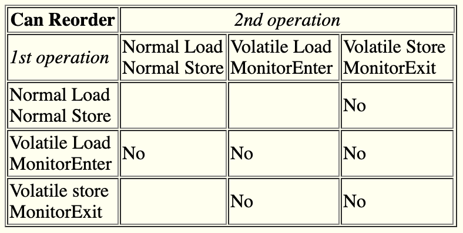
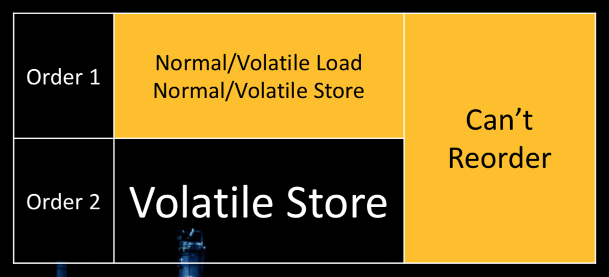
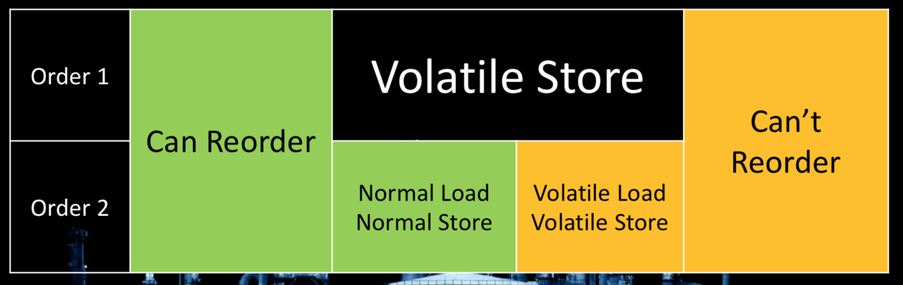
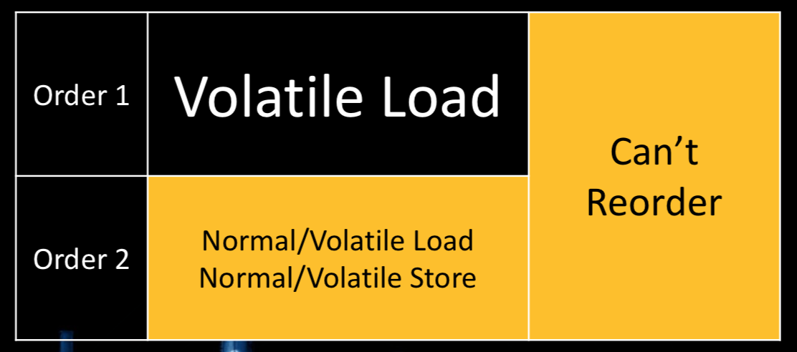

= JMM Rules

Pequeño resumen de las reglas de reordenamiento aplicadas a volatile y monitors. 

* Las mismas reglan que aplican a _Volatile Load_ aplican a _Monitor Enter_.
* Las mismas reglan que aplican a _Volatile Store_ aplican a _Monitor Exit_.

== Volatile Store (Rule 1)

* Cualquier load/store(normal o volatile) seguido de un `volatile store` *NO PUEDE* ser reordenado.

== Volatile Store (Rule 2)

* Un `volatile store` seguido por cualquier load/store(normal) *PUEDE* ser reordenado.
* Un `volatile store` seguido por cualquier load/store(volatile) *NO PUEDE* ser reordenado.

== Volatile Load (Rule 1)

* Un `volatile load` seguido por cualquier load/store(normal o volatile) *NO PUEDE* ser reordenado.

