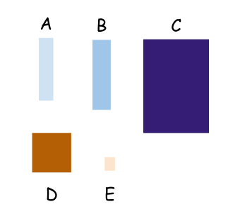

= Partial and Total Order

Esta es una traducción del articulo https://eli.thegreenplace.net/2018/partial-and-total-orders/[partial and total orders]

Imaginemos un conjunto de rectangulos de distintos tamaños; Asumamos que no hay dos rectangulos que tengas las mismas medidas en este conjunto. El conjunto es:

Vamos a decir que la caja X cabe dentro de la caja Y, si podemos encerrar de forma fisica X dentro de Y; en otras palabras, si las dimensiones de Y son mas grandes que las de X. En este ejemplo:

* A puede caber en la caja B, pero no al reves.
* E puede caber dentro de todas las cajas, pero no otras cajas pueden caber en E.
* A, B, D, E pueden caber dentro de C, pero C no puede caber en ninguna otra.
* D no puede caber dentro de A o B, ni tampoco pueden A o B caber dentro de D.

Como veremos pronto, en este caso "fits" es un orden parcial en un conjunto de rectangulos 2D, porque aunque podemos ordenar algunas de las cajas con respecto a las otras, no todos los pares tienen orden relativo entre si (por ejemplo, A y D).

Si todos los pares de cajas tuvieran un orden relativo _por ejemplo, si consideramos este conjunto sin la caja D_ podriamos definir un orden total en el conjunto. Otro ejemplo es un conjunto de cuadrados en 2D (En lugar de rectangulos); siempre y cuando todos los cuadrados en el conjunto tengan un tamaño unico.footnote:[Como habran notado se utilizo la palabra "unico" lo cual hablando de conjuntos puede sonar superfluo; despues de todo, los conjuntos estan definidos para tener elementos distintos. Dicho eso, no es claro lo que "distinto" significa. En nuestro caso, distinto puede referirse a la identidad completa de las cajas; por ejemplo, dos cajas pueden tener las mismas dimensiones pero distinto color - entonces ellas no serian lo mismo desde el punto de vista de un conjunto. Ademas, en programación, la identidad es aún más discutible y puede definirse para tipos específicos de maneras específicas.], siempre podemos definir un orden total en ellos porque para cada par de cuadrados el primero puede caber en el segundo o vice versa.

== Definicion matematica

Vamos a desarrolar un enfoque matematico acerca del ordenamiento, por lo cual tendremos que sumergirnos en teoria de conjuntos
y relaciones, solo vamos a hablar de relaciones binarias.

Dado un conjunto A, una relacion en A es un conjunto de pares con elementos de A. Un poco mas riguroso, dado que `A x A` es el conjunto conteniendo todos los posibles pares ordenados formados desde A. (a.k.a Producto Cartesiano de A), se define R como la relacion de A si es un subconjunto de `A x A` or `R ⊆ A x A`.

Por ejemplo, dado el conjunto `A = {1, 2, 3}`, entonces:

`A x A = {(1, 1),(1, 2),(1, 3),(2, 1),(2, 2),(2, 3),(3, 1),(3, 2),(3, 3)}`

Es importante notar que definimos explícitamente los pares a ordenar, lo que significa que (1, 2) y (2, 1) son dos elementos distintos en este conjunto.

Por definicion, cualquier subconjunto de `A x A` es una relacion de A. Por ejemplo `R = {(1, 1), (2, 2), (3, 3)}`, en programaccion usualmente usamos el termino "predicate" para expresar una idea similar. Un predicado es una funcion con un resultado binario, y la correspondencia con relaciones es trivial - nosotros decimos que todos los pares que pertenencen a la relacion satisfacen el predicado y vice versa. Si definimos un predicado R(x, y) para ser verdadero si y solo si `x == y`, obtendremos la relacion anterior.

Una notacion abreviada que hara las definiciones mas claras; nosotros decimos `xRy` cuando `(x, y) ∈ R`. En nuestro conjunto de ejemplo `1R1`, `2R2` y `3R3`. Esta notacion es media rara, pero es la aceptada en matematica; por lo tanto usaremos esa para consistencia con otras fuentes.

