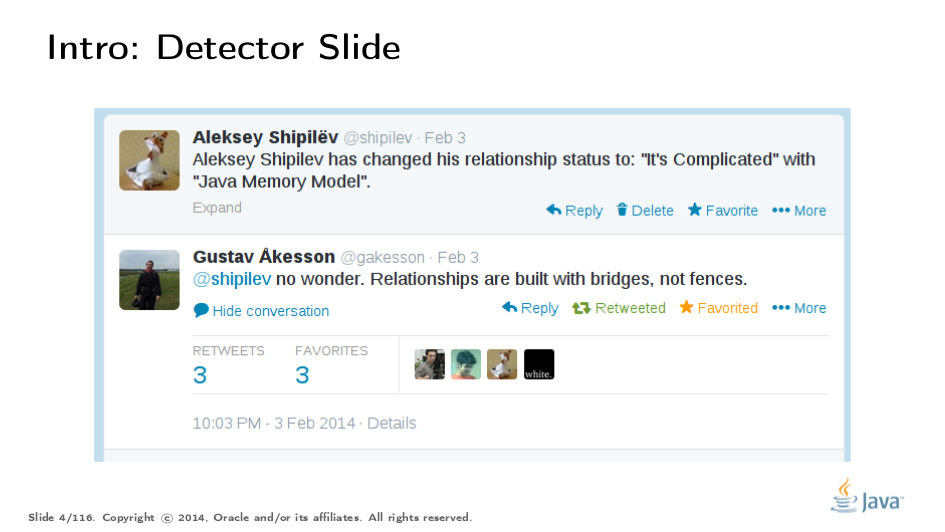

= Java Memory Model Pragmatics (transcripción) en español
:toc: macro

Este repositorio contiene la traduccion de la charla https://shipilev.net/blog/2014/jmm-pragmatics[jmm-pragmatics] brindada por https://shipilev.net[Aleksey Shipilёv], ademas ejemplifica algunos de los conceptos utilizando la herramienta link:JCStress.adoc[jcstress]. Este documento es una guia para ir explicando diversos conceptos que estan relacionado con el comportamiento del Java Memory Model, por lo cual encontraremos distintos links a documentos auxiliares.

toc::[]
== Prologo
El Java Memory Model(JMM) es una de las partes mas complicadas de la Java Spec, la cual al menos deberia ser comprendida por frameworks developers. Desafortunadamente, esta redactado de tal manera que se necesitan algunos senior developers para descifrarlo. La mayoria de los developers no utlizan de forma correcta las reglas definidas por el JMM, ni tampoco crean estructuras basadas en ellas, sino que ciegamente copian construcciones creadas por alguien mas sin entender los limites de su aplicabilidad. Si sos uno de esos developers que no esta interesado en hardcore concurrency, puedes evitar leer esto e ir directo a algo mas de alto nivel, como https://www.amazon.com/Java-Concurrency-Practice-Brian-Goetz/dp/0321349601["Java Concurrency in Practice"]. Si sos uno de esos senior developers que esta interesado en saber como funciona todo esto, continua leyendo!

La charla "Java Memory Model Pragmatics", fue brindada en 2014 en varias conferencias, mayormente en Rusia. Dado que parecia haber una cantidad limitada de conferencias con la capacidad para cubrir una charla tan larga y debido a una necesidad concreta sobre exponer cierto material de lectura para unos workshop en JVMLS, se decidio hacer la transcripción al ingles.

Estaremos reutilizando un monton de slides, y trataremos de construir una narracion basada en ellas. Algunas veces los slides son auto-explicativos y no brindaremos una explicacion. Los slides estan disponibles en https://shipilev.net/talks/narnia-2555-jmm-pragmatics-ru.pdf[Ruso] e https://shipilev.net/talks/narnia-2555-jmm-pragmatics-en.pdf[Ingles].

Se agradece a https://twitter.com/BrianGoetz[Brian Goetz], Doug Lea, David Holmes, https://twitter.com/kuksenk0[Sergey Kuksenko], Dmitry Chyuko, https://twitter.com/AstragaliUSA[Mark Cooper], https://twitter.com/cscotta[C. Scott Andreas], https://twitter.com/joejkearney[Joe Kearney] y muchos otros por sus correciones y comentarios utiles. La seccion sobre "final fields" contiene informacion provista por https://twitter.com/VladimirSitnikv[Vladimir Sitnikov] y Valentin Kovalenko, asi como el extracto de su charla sobre http://www.slideshare.net/VladimirSitnikv/final-field-semantics["Final Fields Semantics"].

== Introduccion

== Parte I. Acceso atomico (Access Atomicity)
Acceso atomico
