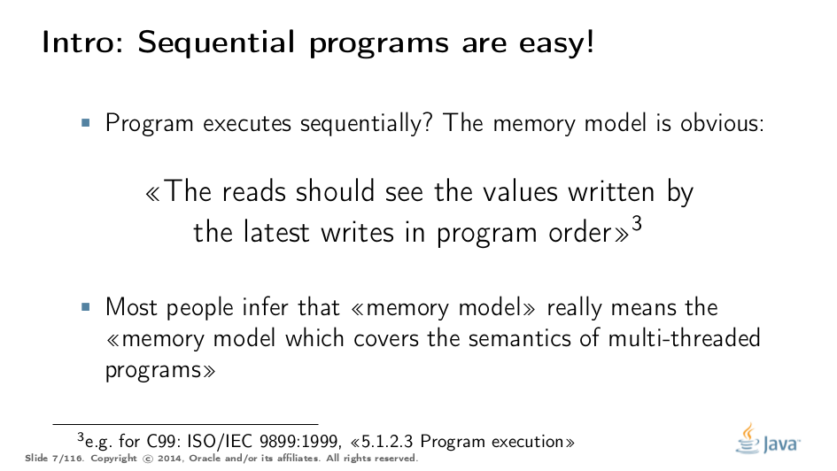
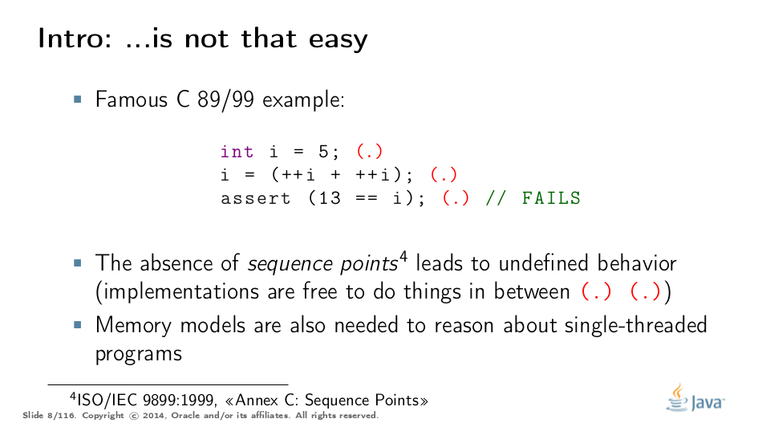
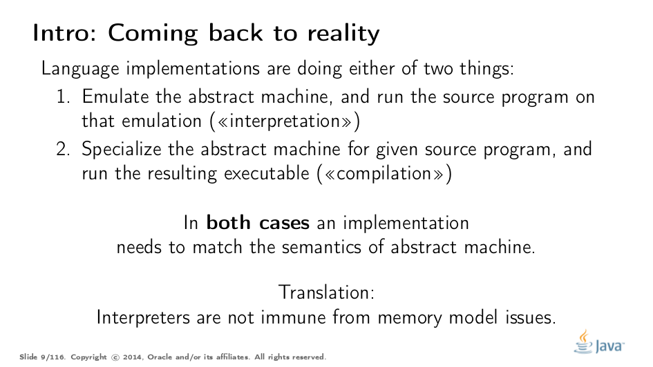
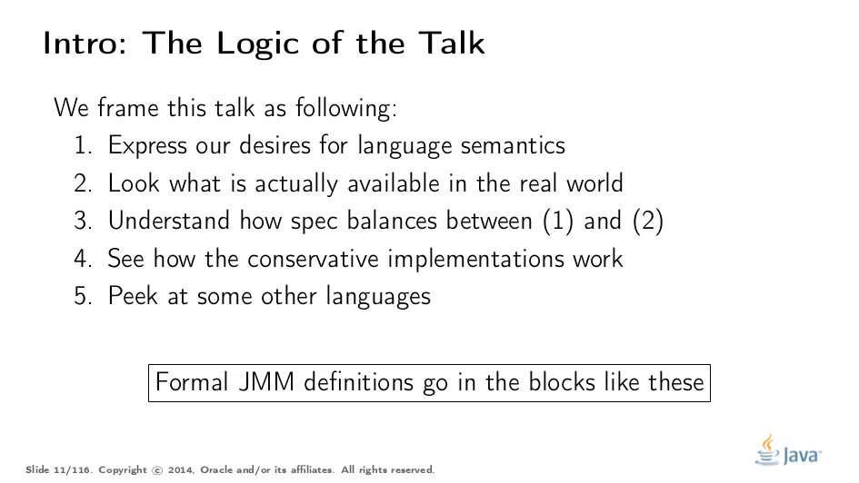

= Java Memory Model Pragmatics (transcripción al español)
:toc: macro

Este repositorio contiene la traduccion de la charla https://shipilev.net/blog/2014/jmm-pragmatics[jmm-pragmatics] brindada por https://shipilev.net[Aleksey Shipilёv], ademas ejemplifica algunos de los conceptos utilizando la herramienta link:JCStress.adoc[jcstress]. Este documento es una guia para ir explicando diversos conceptos que estan relacionado con el comportamiento del Java Memory Model, por lo cual encontraremos distintos links a documentos auxiliares.

toc::[]
== Prologo
El Java Memory Model(JMM) es una de las partes mas complicadas de la Java Spec, la cual al menos deberia ser comprendida por frameworks developers. Desafortunadamente, esta redactado de tal manera que se necesitan algunos senior developers para descifrarlo. La mayoria de los developers no utlizan de forma correcta las reglas definidas por el JMM, ni tampoco crean estructuras basadas en ellas, sino que ciegamente copian construcciones creadas por alguien mas sin entender los limites de su aplicabilidad. Si sos uno de esos developers que no esta interesado en hardcore concurrency, puedes evitar leer esto e ir directo a algo mas de alto nivel, como https://www.amazon.com/Java-Concurrency-Practice-Brian-Goetz/dp/0321349601["Java Concurrency in Practice"]. Si sos uno de esos senior developers que esta interesado en saber como funciona todo esto, continua leyendo!

La charla "Java Memory Model Pragmatics", fue brindada en 2014 en varias conferencias, mayormente en Rusia. Dado que parecia haber una cantidad limitada de conferencias con la capacidad para cubrir una charla tan larga y debido a una necesidad concreta sobre exponer cierto material de lectura para unos workshop en JVMLS, se decidio hacer la transcripción al ingles.

Estaremos reutilizando un monton de slides, y trataremos de construir una narracion basada en ellas. Algunas veces los slides son auto-explicativos y no brindaremos una explicacion. Los slides estan disponibles en https://shipilev.net/talks/narnia-2555-jmm-pragmatics-ru.pdf[Ruso] e https://shipilev.net/talks/narnia-2555-jmm-pragmatics-en.pdf[Ingles].

Se agradece a https://twitter.com/BrianGoetz[Brian Goetz], Doug Lea, David Holmes, https://twitter.com/kuksenk0[Sergey Kuksenko], Dmitry Chyuko, https://twitter.com/AstragaliUSA[Mark Cooper], https://twitter.com/cscotta[C. Scott Andreas], https://twitter.com/joejkearney[Joe Kearney] y muchos otros por sus correciones y comentarios utiles. La seccion sobre "final fields" contiene informacion provista por https://twitter.com/VladimirSitnikv[Vladimir Sitnikov] y Valentin Kovalenko, asi como el extracto de su charla sobre http://www.slideshare.net/VladimirSitnikv/final-field-semantics["Final Fields Semantics"].

== Introduccion

image::images/jmm/001.png[]

Primero, una slide para romper el hielo. https://twitter.com/gakesson[@gakesson], *saludanos!*

image::images/jmm/002.png[]

Si leemos cualquier spec acerca de un lenguaje, vamos a notar que puede ser dividad en dos partes relacionadas pero distintas. Primero, nos encontramos con una parte simple, la cual llamamos sintaxis (syntax), la cual describe como escribir programas en ese lenguaje. Segundo, la parte mas complicada es conocida como semantica (semantics), la cual describe exactamente lo que significa cada sintaxis en particular. Generalmente, las spec describen la semantica por medio del comportamiento de una https://es.wikipedia.org/wiki/Máquina_abstracta[abstract machine] que ejecuta el programa, de este modo la spec es solo una especificacion de abstract machine.

image::images/jmm/003.png[]

Cuando el lenguaje posee almacenamiento (Variables, Heap Memory, etc.), la abstract machine tambien posee almacenamiento, y tenemos que definir un conjuntos de reglas acerca de como se comporta el almacenamiento. Esto es lo que llamamos "memory model". Si el lenguaje no posee almacenamiento explicito (e.g los datos son pasados en contextos de llamadas), entonces tu modelo de memoria es bastante simple. El "memory model" parece responder a una pregunta simple: ¿Que valores puede observar una instruccion read?

En programas secuenciales, esto parece ser una pregunta sin mucho sentido, porque si nuestro programa es secuencial, cada store en la memoria viene dado con un determinado orden, y es obvio que cada "read" debe observar el ultimo "write" aplicado. Por eso solemnos cruzarnos con el concepto de "memory model" en programas mult-thread, donde esta pregunta se vuelve mas complicada de responder. Sin embargo el "memory model" tambien importa en programas secuenciales (Aunque en este caso esta inteligentemente disfrazado en la nocion de orden de evaluacion).

Por ejemplo, el abominable ejemplo de link:UndefinedBehaviour.adoc["undefined behaviour"] en un programa "C", que utiliza algunos incremento entre los link:SequencePoint.adoc["sequence points"].
Este programa puede satisfacer la condicion establecidad, fallar o incluso link:UndefinedBehaviour.adoc#nasal-demons["nasal demons"]. Uno podria argumentar que el resultado de este programa puede ser diferente porque el orden de evaluacion de los incrementos es diferente, pero eso no explicaria, el resultado de "12", cuando ninguno de los incrementos puede ver el valor escrito por el otro. Esta es una preocupación del "memory model": ¿Que valor debe ser visto por cada incremento, y que deberia ser almacenado?

De cualquier manera, si nos presentan el desafio de implementar un lenguaje, podemos optar por "Interpretacion" o "Compilacion", independientemente de nuestra eleccion ambos caminos estan conectados por link:FutamuraProjections.adoc[Futamura Projections].

The practical takeaway is that both interpreter and compiler are tasked with emulating the abstract machine. Compilers are usually blamed for screwing up the memory models and multi-threaded programs, but interpreters are not immune, either. Failing to run an interpreter to the abstract machine spec may result in memory model violations. The simplest example: cache the field values over volatile reads in an interpreter, and you are done for. This takes us to an interesting trade-off.

image::images/jmm/007.png[]

The very reason why programming languages still require smart developers is the absence of hypersmart compilers. "Hyper" is not a overstatement: some of the problems in compiler engineering are undecidable, that is, non-solvable even in theory, let alone in practice. Other interesting problems may be theoretically feasible, but not practical. Therefore, to make practical (optimizing) compilers possible, we need to cause some inconvenience in the language. The same goes for hardware, since (at least for Turing machines) it is just the algorithms in silica.

To elaborate on this thought, the rest of the talk is structured as follows.

== Parte I. Acceso atomico (Access Atomicity)
Acceso atomico
