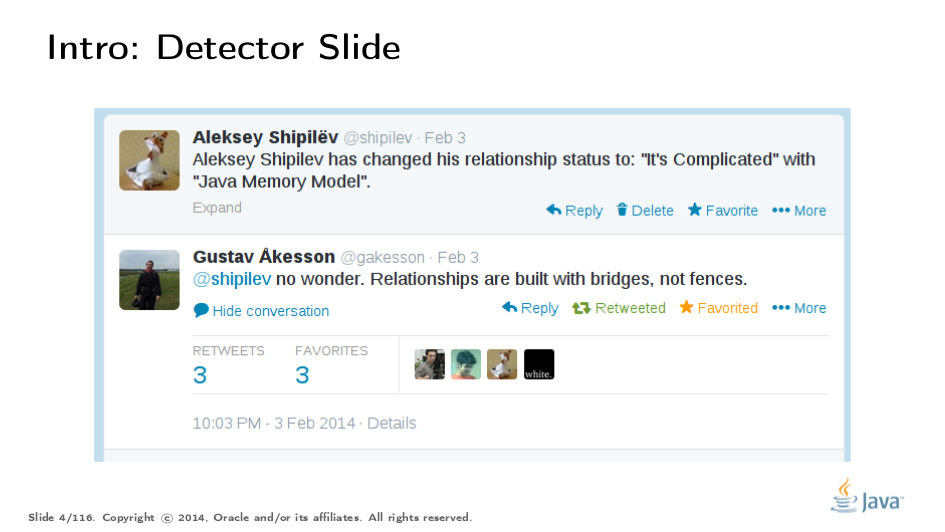
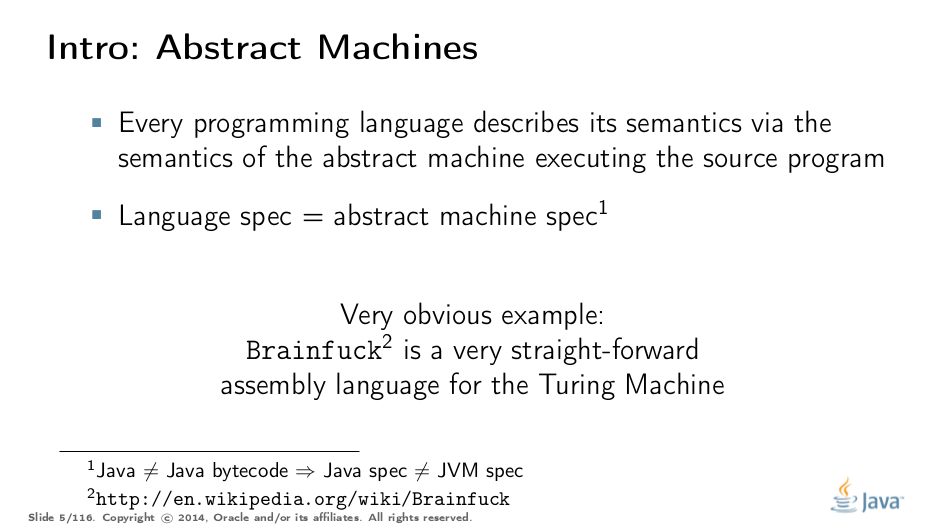
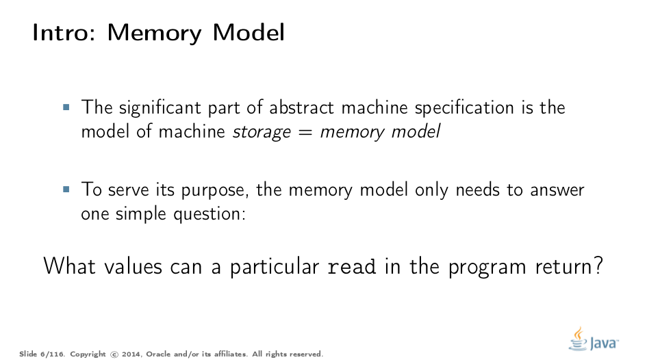
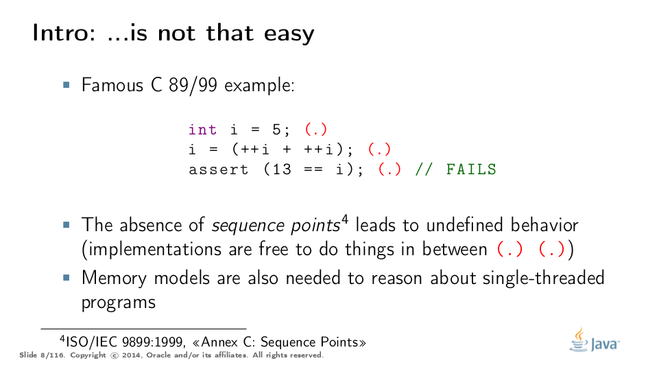
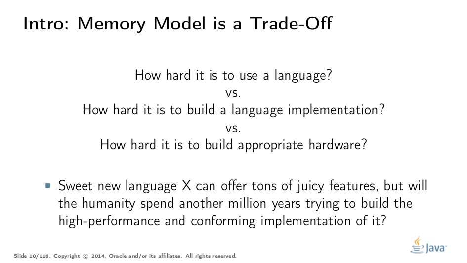
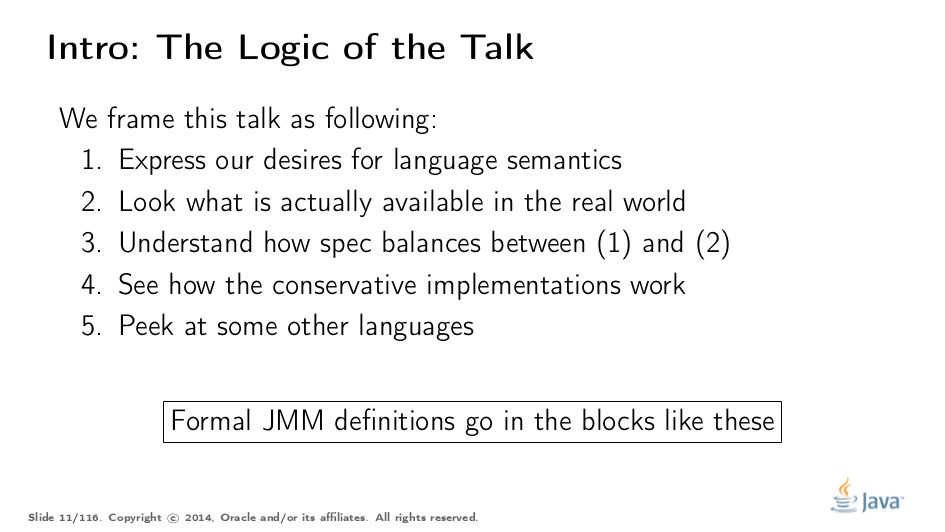

= Java Memory Model Pragmatics (transcripción) en español
:toc: macro

Este repositorio contiene la traduccion de la charla https://shipilev.net/blog/2014/jmm-pragmatics[jmm-pragmatics] brindada por https://shipilev.net[Aleksey Shipilёv], ademas ejemplifica algunos de los conceptos utilizando la herramienta link:JCStress.adoc[jcstress]. Este documento es una guia para ir explicando diversos conceptos que estan relacionado con el comportamiento del Java Memory Model, por lo cual encontraremos distintos links a documentos auxiliares.

toc::[]
== Prologo
El Java Memory Model(JMM) es una de las partes mas complicadas de la Java Spec, la cual al menos deberia ser comprendida por frameworks developers. Desafortunadamente, esta redactado de tal manera que se necesitan algunos senior developers para descifrarlo. La mayoria de los developers no utlizan de forma correcta las reglas definidas por el JMM, ni tampoco crean estructuras basadas en ellas, sino que ciegamente copian construcciones creadas por alguien mas sin entender los limites de su aplicabilidad. Si sos uno de esos developers que no esta interesado en hardcore concurrency, puedes evitar leer esto e ir directo a algo mas de alto nivel, como https://www.amazon.com/Java-Concurrency-Practice-Brian-Goetz/dp/0321349601["Java Concurrency in Practice"]. Si sos uno de esos senior developers que esta interesado en saber como funciona todo esto, continua leyendo!

La charla "Java Memory Model Pragmatics", fue brindada en 2014 en varias conferencias, mayormente en Rusia. Dado que parecia haber una cantidad limitada de conferencias con la capacidad para cubrir una charla tan larga y debido a una necesidad concreta sobre exponer cierto material de lectura para unos workshop en JVMLS, se decidio hacer la transcripción al ingles.

Estaremos reutilizando un monton de slides, y trataremos de construir una narracion basada en ellas. Algunas veces los slides son auto-explicativos y no brindaremos una explicacion. Los slides estan disponibles en https://shipilev.net/talks/narnia-2555-jmm-pragmatics-ru.pdf[Ruso] e https://shipilev.net/talks/narnia-2555-jmm-pragmatics-en.pdf[Ingles].

Se agradece a https://twitter.com/BrianGoetz[Brian Goetz], Doug Lea, David Holmes, https://twitter.com/kuksenk0[Sergey Kuksenko], Dmitry Chyuko, https://twitter.com/AstragaliUSA[Mark Cooper], https://twitter.com/cscotta[C. Scott Andreas], https://twitter.com/joejkearney[Joe Kearney] y muchos otros por sus correciones y comentarios utiles. La seccion sobre "final fields" contiene informacion provista por https://twitter.com/VladimirSitnikv[Vladimir Sitnikov] y Valentin Kovalenko, asi como el extracto de su charla sobre http://www.slideshare.net/VladimirSitnikv/final-field-semantics["Final Fields Semantics"].

== Introduccion

Primero, una slide para romper el hielo. https://twitter.com/gakesson[@gakesson], *saludanos!*

If you read just about any language spec, you will notice it can be logically divided into two related, but distinct parts. First, a very easy part, is the language syntax, which describes how to write programs in the language. Second, the largest part, is the language semantics, which describes exactly what a particular syntax construct means. Language specs usually describe the semantics via the behavior of an abstract machine which executes the program, so the language spec in this manner is just an abstract machine spec.

When your language has storage (in the form of variables, heap memory, etc.), the abstract machine also has storage, and you have to define a set of rules concerning how that storage behaves. That’s what we call a memory model. If your language does not have explicit storage (e.g. you pass the data around in call contexts), then your memory model is darn simple. In storage-savvy languages, the memory models appear to answer a simple question: "What values can a particular read observe?"

image::slides/JMM-Slide04.png[]

In sequential programs, that seems a vacuous question to ask: since you have the sequential program, the stores into memory are coming in some given order, and it is obvious that the reads should observe the latest writes in that order. That is why people usually meet with memory models only for multi-threaded programs, where this question becomes complicated. However, memory models matter even in the sequential cases (although they are often cleverly disguised in the notion of evaluation order).

For example, the infamous example of undefined behavior in a C program that packs a few increments between the sequence points. This program can satisfy the given assert, but can also fail it, or otherwise summon nasal demons. One could argue that the result of this program can be different because the evaluation order of increments is different, but it would not explain, e.g. the result of 12, when neither increment saw the written value from the other. This is the memory model concern: what value should each increment see (and by extension, what it would store).

image::slides/JMM-Slide06.png[]

Either way, when presented with a challenge of implementing the particular language, we can go one of two ways: interpretation, or compilation of abstract machine to the target hardware. Both interpretation and compilation are connected via https://en.wikipedia.org/wiki/Partial_evaluation#Futamura_projections[Futamura Projections] anyway.

The practical takeaway is that both interpreter and compiler are tasked with emulating the abstract machine. Compilers are usually blamed for screwing up the memory models and multi-threaded programs, but interpreters are not immune, either. Failing to run an interpreter to the abstract machine spec may result in memory model violations. The simplest example: cache the field values over volatile reads in an interpreter, and you are done for. This takes us to an interesting trade-off.

The very reason why programming languages still require smart developers is the absence of hypersmart compilers. "Hyper" is not a overstatement: some of the problems in compiler engineering are undecidable, that is, non-solvable even in theory, let alone in practice. Other interesting problems may be theoretically feasible, but not practical. Therefore, to make practical (optimizing) compilers possible, we need to cause some inconvenience in the language. The same goes for hardware, since (at least for Turing machines) it is just the algorithms in silica.

To elaborate on this thought, the rest of the talk is structured as follows.

== Parte I. Acceso atomico (Access Atomicity)
Acceso atomico
