= Java Memory Model Pragmatics (transcripción al español)
:toc: macro
:sectnumlevels: 4

Este repositorio contiene la traducción de la charla https://shipilev.net/blog/2014/jmm-pragmatics[jmm-pragmatics] brindada por https://shipilev.net[Aleksey Shipilёv], además ejemplifica algunos de los conceptos utilizando la herramienta link:JCStress.adoc[jcstress]. Este documento es una guía para ir explicando diversos conceptos que están relacionado con el comportamiento del Java Memory Model, por lo cual encontraremos distintos links a documentos auxiliares.

toc::[]
== Prologo
El Java Memory Model(JMM) es una de las partes mas complicadas de la Java Spec, la cual al menos debería ser comprendida por frameworks developers. Desafortunadamente, esta redactado de tal manera que se necesitan algunos senior developers para descifrarlo. La mayoría de los developers no utilizan de forma correcta las reglas definidas por el JMM, ni tampoco crean estructuras basadas en ellas, sino que ciegamente copian construcciones creadas por alguien mas sin entender los limites de su aplicabilidad. Si eres uno de esos developers que no esta interesado en hardcore concurrency, puedes evitar leer esto e ir directo a algo mas de alto nivel, como https://www.amazon.com/Java-Concurrency-Practice-Brian-Goetz/dp/0321349601["Java Concurrency in Practice"]. Si eres uno de esos senior developers que esta interesado en saber como funciona todo esto, continua leyendo!

La charla "Java Memory Model Pragmatics", fue brindada en 2014 en varias conferencias, mayormente en Rusia. Dado que parecía haber una cantidad limitada de conferencias con la capacidad para cubrir una charla tan larga y debido a una necesidad concreta sobre exponer cierto material de lectura para unos workshop en JVMLS, se decidió hacer la transcripción al ingles.

Estaremos reutilizando un montón de slides, y trataremos de construir una narración basada en ellas. Algunas veces los slides son auto-explicativos y no brindaremos una explicación. Los slides estan disponibles en https://shipilev.net/talks/narnia-2555-jmm-pragmatics-ru.pdf[Ruso] e https://shipilev.net/talks/narnia-2555-jmm-pragmatics-en.pdf[Ingles].

Se agradece a https://twitter.com/BrianGoetz[Brian Goetz], Doug Lea, David Holmes, https://twitter.com/kuksenk0[Sergey Kuksenko], Dmitry Chyuko, https://twitter.com/AstragaliUSA[Mark Cooper], https://twitter.com/cscotta[C. Scott Andreas], https://twitter.com/joejkearney[Joe Kearney] y muchos otros por sus correcciones y comentarios útiles. La sección sobre "final fields" contiene información provista por https://twitter.com/VladimirSitnikv[Vladimir Sitnikov] y Valentin Kovalenko, así como el extracto de su charla sobre http://www.slideshare.net/VladimirSitnikv/final-field-semantics["Final Fields Semantics"].

== Introducción

image::images/jmm/001.png[]

Primero, una slide para romper el hielo. https://twitter.com/gakesson[@gakesson], *Salúdanos!*

---

image::images/jmm/002.png[]

Si leemos cualquier spec acerca de un lenguaje, vamos a notar que puede ser separadas en dos partes relacionadas pero distintas. Primero, nos encontramos con una parte simple, la cual llamamos sintaxis (syntax), la cual describe como escribir programas en ese lenguaje. Segundo, la parte mas complicada es conocida como semantica (semantics), la cual describe exactamente lo que significa cada sintaxis en particular. Generalmente, las spec describen la semántica por medio del comportamiento de una https://es.wikipedia.org/wiki/Máquina_abstracta[abstract machine] que ejecuta el programa, de este modo la spec es solo una especificación de abstract machine.

---

image::images/jmm/003.png[]

Cuando el lenguaje posee almacenamiento (Variables, Heap Memory, etc.), la abstract machine también posee almacenamiento, y tenemos que definir un conjuntos de reglas acerca de como se comporta el almacenamiento. Esto es lo que llamamos "Memory Model". Si el lenguaje no posee almacenamiento explicito (e.g los datos son pasados en contextos de llamadas), entonces su modelo de memoria es bastante simple. El "Memory Model" parece responder a una pregunta simple: ¿Qué valores puede observar una instrucción read?

---

image::images/jmm/004.png[]

En programas secuenciales, esto parece ser una pregunta sin mucho sentido, porque si nuestro programa es secuencial, cada store en la memoria viene dado con un determinado orden, y es obvio que cada "read" debe observar el ultimo "write" aplicado. Por eso usualmente nos cruzamos con el concepto de "Memory Model" en programas multi-hilos, donde esta pregunta se vuelve un poco mas complicada de responder. Sin embargo el "Memory Model" también importa en programas secuenciales (Aunque en este caso esta inteligentemente disfrazado en la noción de orden de evaluación).

---

image::images/jmm/005.png[]

Por ejemplo, el abominable ejemplo de link:UndefinedBehaviour.adoc["undefined behaviour"] en un programa "C", que utiliza algunos incremento entre los link:SequencePoint.adoc["sequence points"]. Este programa puede satisfacer la condición establecida, fallar o incluso link:UndefinedBehaviour.adoc#nasal-demons["nasal demons"]. Uno podría argumentar que el resultado de este programa puede ser diferente porque el orden de evaluación de los incrementos es diferente, pero eso no explicaría, el resultado de "12", cuando ninguno de los incrementos puede ver el valor escrito por el otro. Esta es una preocupación del "Memory Model": ¿Qué valor debe ser visto por cada incremento, y que debería ser almacenado?

---

image::images/jmm/006.png[]

De cualquier manera, si nos presentan el desafío de implementar un lenguaje, podemos optar por "Interpretación" o "Compilación", independientemente de nuestra elección ambos caminos están conectados por link:FutamuraProjections.adoc[Futamura Projections].

La conclusión práctica es que tanto el intérprete y compilador tienen la tarea de emular una máquina abstracta. Los compiladores suelen ser acusados de arruinar los modelos de memoria y en programas multi-hilos, pero los interpretes no son inmunes. Fallar al ejecutar un interprete para la maquina abstracta puede generar violaciones al modelo de memoria. Lo cual nos lleva a un interesante trade-off.

---

image::images/jmm/007.png[]

La razón por la cual los lenguajes de programación necesitan que desarrolladores hábiles se debe a la ausencia "hypersmart compilers". "Hyper" no es una exageración: Alguno de los problemas en la creación de compiladores no tienen solución en la teoría y menos en la practica. Otros problemas interesantes pueden ser posibles en la teoría pero no en la practica.

---

image::images/jmm/008.png[]

Para procesar estas ideas, el resto de la charla estará estructurada de la siguiente manera.

---

== Parte I. Acceso atomico (Access Atomicity)

=== ¿Qué queremos? (What Do We Want)

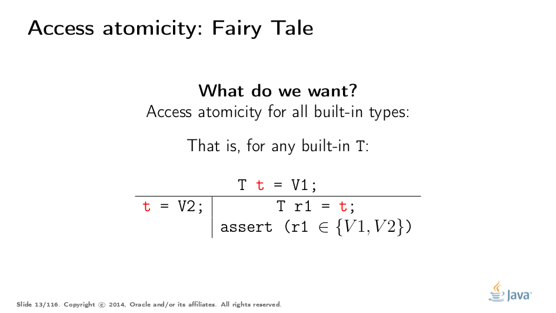

Una de las cosas mas simple para entender en el JMM es la garantía de acceso atómico. Para definir esto vamos a introducir un poco mas de notación. En el ejemplo de este slide, se pueden ver una tabla con dos columnas. Esto lo podemos leer de la siguiente forma, todo lo que esta en el encabezado ya ha sido ejecutado y almacenado en memoria. Cada columna representa a un thread distinto. En este ejemplo el Thread 1 almacena algún valor "V2" en una variable global (O sea compartida por ambos threads), Thread 2 lee esta variable y comprueba si el valor es "V1" o "V2". Queremos asegurarnos que el Thread 2 solo lee valores posibles y no algún valor intermedio.

---

=== ¿Qué tenemos? (What Do We Have)

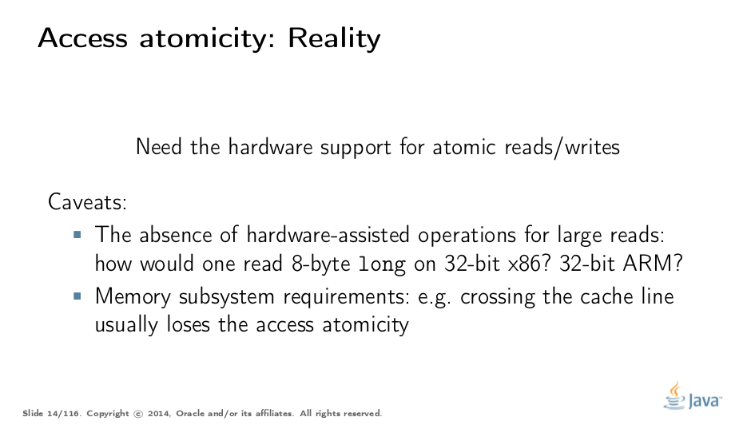

Esto parece un requerimiento bastante obvio para cualquier lenguaje de programación: ¿Cómo esto puede no suceder? y ¿Por qué? Acá tenemos el por qué.

Para asegurar atomicidad antes accesos concurrentes, necesitamos tener instrucciones básicas operando con un determinado tamaño, de otro modo la atomicidad es violada a nivel de instrucción: Si necesitamos separar el acceso en múltiples sub-accesos, estos pueden ser intercalados con otras instrucciones. Pero incluso si tenemos operaciones para determinados tamaños, estas aun pueden no ser atómicas: Por ejemplo la garantía de atomicidad para instrucciones de 2-4 bytes en PowerPC son desconocidas (Se supone que son atómicas).

---

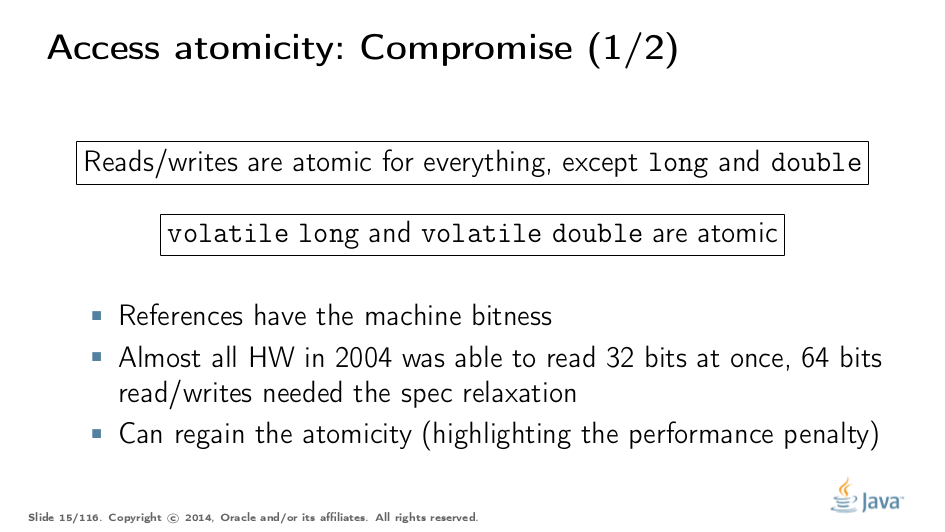

La mayoría de las plataformas garantiza atomicidad hasta accesos de 32 bits, el JMM tiene el mismo *compromiso* y relaja los accesos de 64 bits. De todos modos hay formas de forzar atomicidad para valores de 64 bits, e.g. por medio de un lock en la lectura y escritura aunque esto tiene un costo, por lo cual una posible vía de escape es utilizar *volatile* en donde se requiera de atomicidad y la VM junto con el Hardware harán todo el trabajo, sin importar el costo.

---

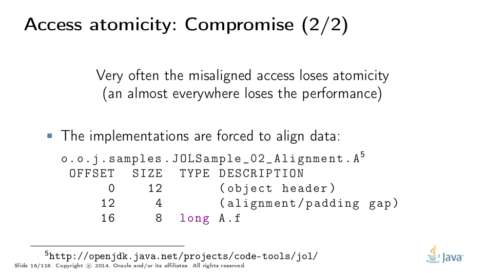

Aunque tengamos operaciones que trabajen con determinado tamaño esto no es suficiente para garantizar la atomicidad en la mayoría de los Hardware. Por ejemplo, si el acceso a los datos causa múltiples transacciones a la memoria principal, la atomicidad no es garantizada, incluso cuando se ejecute una sola instrucción. Si tomamos como ejemplo x86, la atomicidad no esta garantizada si los read/write se expanden a dos líneas distintas de la cache, por que esto requiere dos transacciones a la memoria. Esto es por que en general solo los datos alineados pueden ser leídos o escritos de forma atómica, lo que fuerza a las VMs a link:DataAlignment.adoc[alinear los datos].

En este ejemplo que fue generado con http://openjdk.java.net/projects/code-tools/jol/[JOL], podemos ver que el field de tipo long esta posicionado desde el offset 16, esto se debe a que los objetos se alinean de 8 bytes, podríamos posicionar el long desde el offset 12 pero si hiciéramos eso, el funcionamiento seria dependiente de la plataforma y algunas de ellas no aceptan accesos a datos no alineados y en otros casos pueden haber problemas de performance.

---

=== Probando nuestro entendimiento (Test Your Understanding)

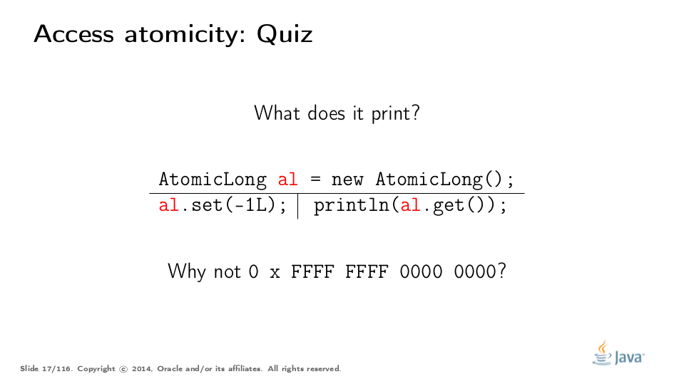

Verifiquemos nuestro entendimiento con una simple pregunta. ¿Es posible leer algún valor intermedio? dado que Java utiliza la link:BinaryRepresentation.adoc[representación binaria] complemento a dos, asignar -1L es equivalente a asignar 1 a todos los bits en el long.

*Respuesta*: Esto funciona de forma correcta porque la clase AtomicLong contiene un field long el cual es volatile.

---

=== Value Types and C/C++

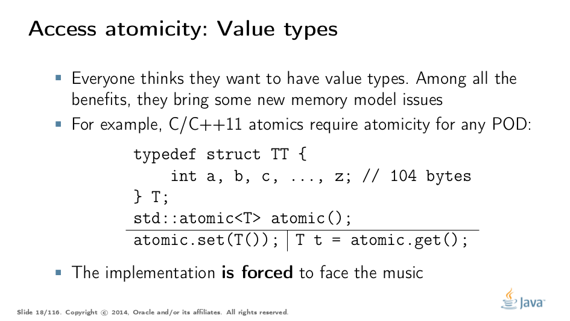

En Java, somos "afortunados" de tener algunos tipos built-in que tienen un tamaño pequeño. En otros lenguajes donde el tamaño es arbitrario, esto presenta algunos desafíos interesantes para el modelo de memoria.

En este ejemplo, C++ es compatible con C soportando estructuras. C++11 adicionalmente soporta std::atomic, lo cual requiere acceso atómico para cada POD (Plain Old Data). Si nosotros definimos el ejemplo del slide la implementación es forzada a manejar accesos de escritura y lectura de forma atómica para 104-bytes. Dado que no hay instrucciones que permitan acceso atómico para ese tamaño la implementación debe recurrir a utilizar link:CAS.adoc[CAS], locking o algo mas.

---

=== JMM Updates

Esta sección cubre las consideraciones sobre atomicidad para el nuevo JMM. Podemos encontrar mas detalle https://shipilev.net/blog/2014/all-accesses-are-atomic/[en este post separado].

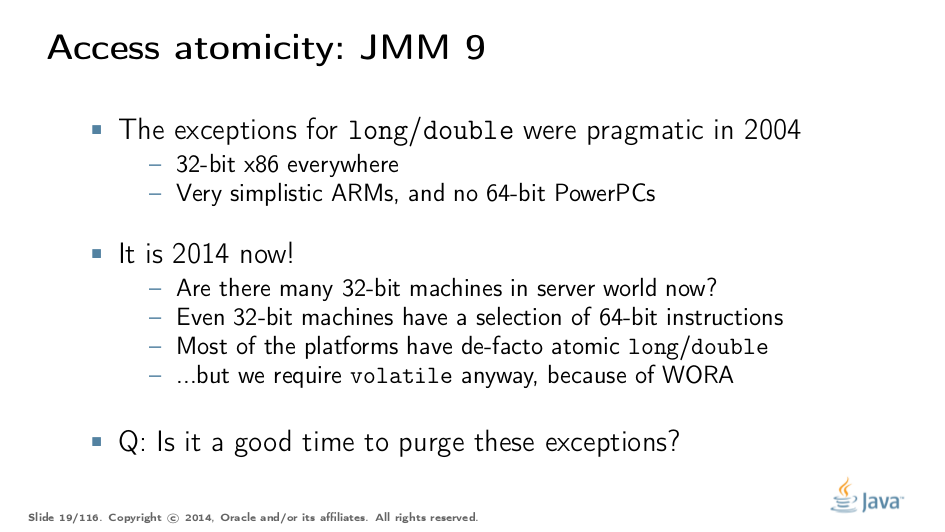

En 2014, Queremos reconsiderar la excepción de los 64 bits? Los developers pueden pensar que los accesos a tipos long/double son atómicos en plataformas de 64 bits, pero esto puede no ser correcto y requieren que el field sea *volatile* para ser portable y por si llegamos a ejecutar en una plataforma de 32 bits. Marcando los field como *volatie* también estamos pagando el costo de las memory barrier.

En otras palabras, dado que *volatile* tiene dos significados:
* Acceso atómico.
* Reordenamiento en la memoria

y no se puede obtener uno sin el otro, podemos especular que el costo de remover esta excepcion. Dado que las VMs manejan la atomicidad de forma separada emitiendo una secuencia especial de instrucciones, nosotros podemos hacer un hack en la JVM para validarlo cuando corre

---

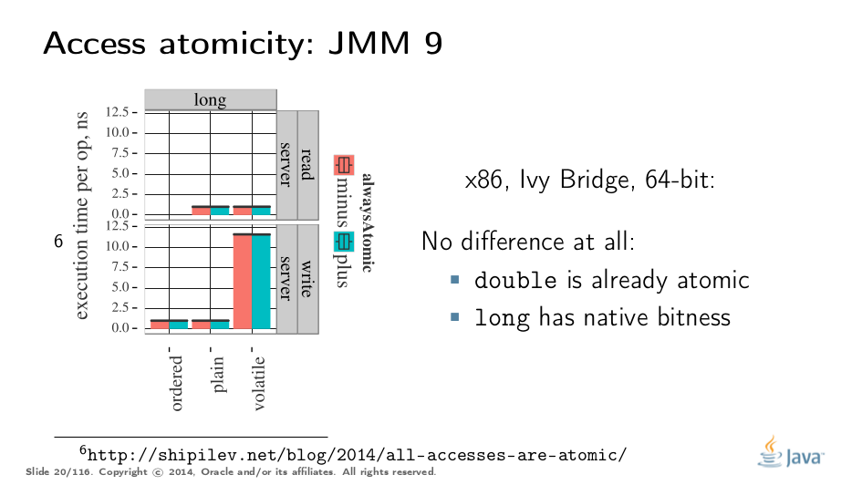

@PendingTranslation It takes some time to understand this chart. We can measure reads and writes of longs — three times for each access mode (plain, volatile, and via Unsafe.putOrdered). If we are implementing the feature correctly, there should be no difference on 64-bit platforms, since the accesses are already atomic. Indeed there is no difference between the colored bars on 64-bit Ivy Bridge.

Notice how heavyweight a volatile long write can be. If I only wanted atomicity, I pay this cost for memory ordering.

---

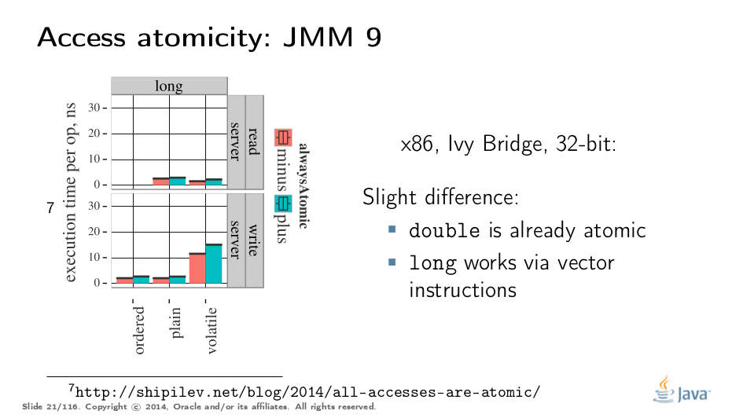

@PendingTranslation It gets more complicated when dealing with 32-bit platforms. There, you will need to inject special instruction sequences to get the atomicity. In the case of x86, FPU load/stores are 64-bit wide even in 32-bit platforms. You pay the cost of "redundant" copies, but not that much.

---

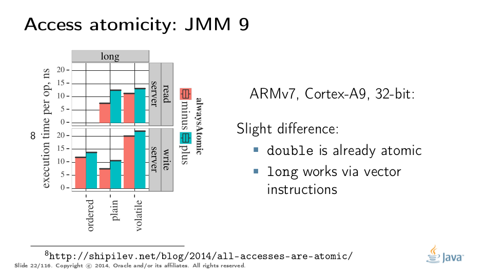

@PendingTranslation On non-x86 platforms, we also have to use alternative instruction sequences to regain atomicity, with predictable performance impact. Note that in this case, as well in the 32-bit x86 case, volatile is a bit slower with enforced atomicity, but that’s a systematic error since we need to also dump the values into a long field to prevent some compiler optimizations.

---

== Parte II. Word Tearing

=== ¿Qué queremos? (What Do We Want)

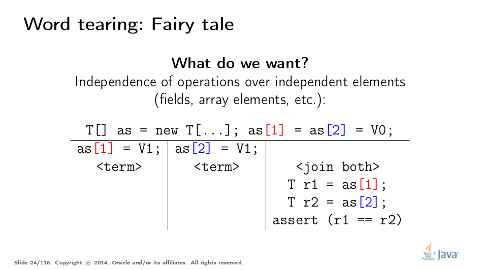

link:WordTearing.adoc[Word tearing] esta relacionado con el acceso atomico.

Si dos variables son distintas, cada accion sobre ellas tambien debe ser distinta y no debe ser afectada por acciones en elementos adyacentes. ¿Como es posible que el ejemplo anterior falle? Muy simple: Si nuestro hardware no puede acceder a distintos elementos de un array, se vera forzado a leer varios elementos, modificar el elemento del monton y luego volver a escribir el monton.

Si dos threads estan haciendo lo mismo en elementos separados, puede suceder que otro thread almacena sus datos, sobreescribiendo los datos almacenados por el primer thread. Esto puede y causa muchos dolores de cabezas si no estamos conscientes de este posible comportamiento y es dificil de saber sin las especificaciones del lenguaje.

---

=== ¿Qué tenemos? (What Do We Have)

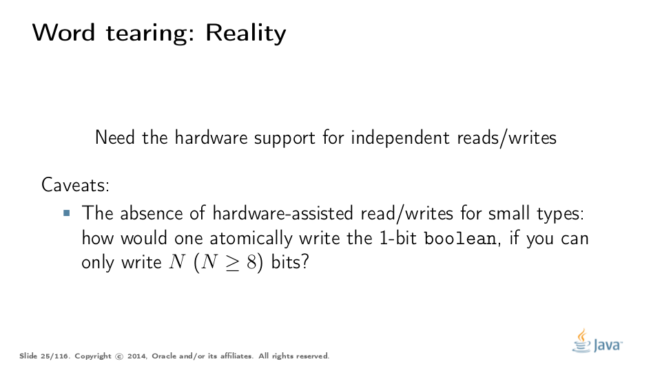

Si nosotros queremos prohibir word tearing, necesitamos soporte para acceso de un determinado tamaño. En el caso mas simple de un boolean[] o un grupo de fields, no se puede tener un acceso de lectura a un unico bit en la mayoria de los hardware, dado que la minima granularidad usualmente es un byte.

---

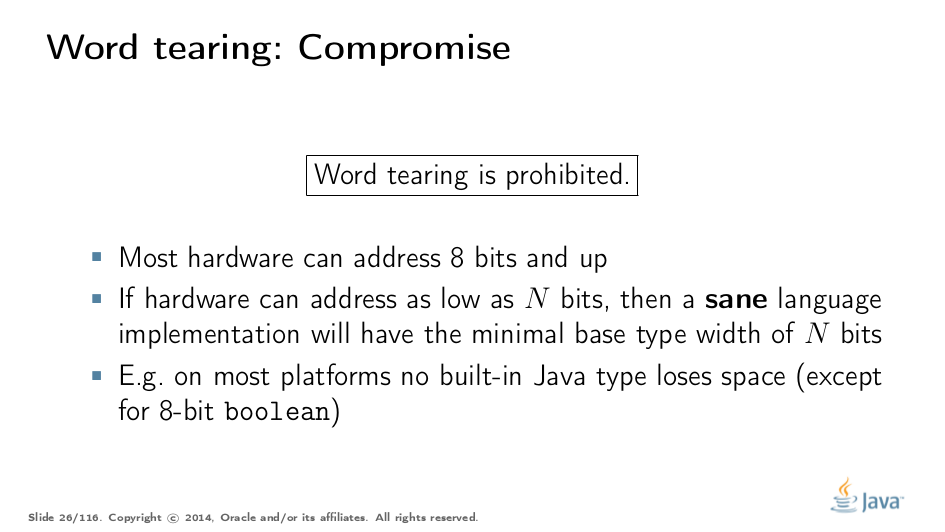

Sorprendentemente, hoy en dia no muchos programadores conocen sobre word tearing.Tiempo atras la mayoría de los programadores estaban familiarizado con esto, y comprendian el sufrimiento de perseguir un error de este tipo.

Por lo tanto, Java decidio ser un lenguaje "amigable" y prohibir este tipo de problemas. Bill Pugh (Creado de FindBugs y lider de JMM JSR 133) http://www.cs.umd.edu/~pugh/java/memoryModel/archive/0978.html[fue bastante claro] acerca de esto. Perseguir un problema de word-tearing en C++ NO ES DIVERTIDO.

Este requerimiento parece simple de implementar con el hardware actual: El unico tipo de dato con el cual debemos tener cuidado es el boolean por que tal vez queremos tomar un byte entero en lugar de un solo bit. Por supuesto tambien debemos manejar posibles optimizaciones del compilador, como almacenar varios read y write en datos adjacentes.

---

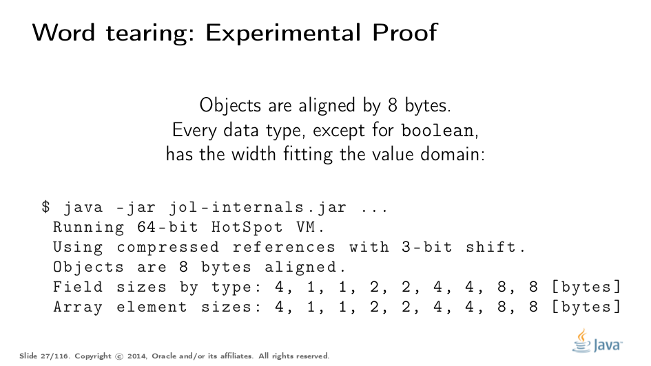

Muchas gente busca el rango de los primitivos en la documentacion con el objetivo de inferir la representacion de estos datos. Aunque lo unico que podemos inferir es el minimo ancho usado para este tipo, supongamos que usamos 2^64 para el tipo long, lo cual no implica que se usen 8 bytes para el long, sino que en principio puedo usar 128 bytes, siempre y cuano esto sea practico por algun motivo.

Sin embargo la gran mayoria ajusta su representacion a los valores de dominio sin malgastar el espacio. La unica excepcion es boolean. Java Object Layout(JOL) es una herramienta que nos permite conocer los tamaños asignados, en la slide podemos ver un ejemplo. El orden de los valores es: referencias, boolean, byte, short, char, int,float, long y double.

---

image::images/jmm/023.png[]

*Respuesta*: Cualquiera de los valores (true, true), (false, true), (true, false) es posible porque BitSet almacena los valores en un long[] y utiliza mascaras de bits para acceder a un bit particular. Esta tecnica rompe las garanticas de word-tearing, pero el problema es de la implementacion. Los Javadocs de BitSet dicen que no es thread-safe, podemos decir que este es un ejemplo artificial.

---

=== Layout Control and C/C++

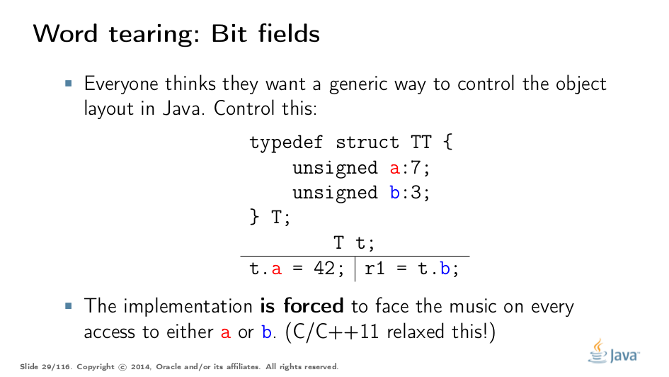

Algunas personas quieren tener control sobre el layout de memoria, para tener un mejor footprint en casos bordes y/o mejor performance. Pero en un lenguaje que permite un layout arbitrario de sus variables, no se puede prohibir el word tearing porque nosotros deberiamos pagar el precio de esto, como en el ejemplo.

No hay instrucciones maquinas que puedan escribir 7 bits, o leer 3 bytes en un sola pasada, entonces las implementaciones deberian ser creativas si ellos quieren evitar word-tearing. C/C++11 permite usar esta potente herramienta, pero nos dice que una vez que empecemos a usarla estaremos por nuestra cuenta.

---

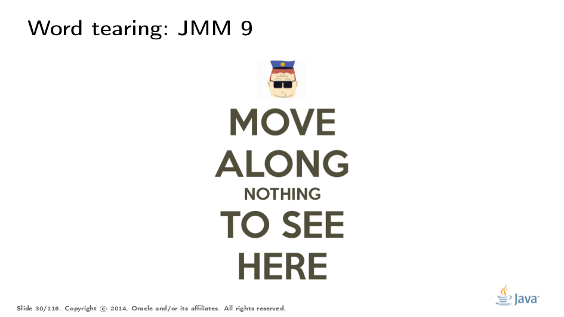

Nadie cuestiona si word-tearing debe permanecer prohibido.

---

== Parte III. SC-DRF (Sequential Consistency - Data Race Free)

=== ¿Qué queremos? (What Do We Want)

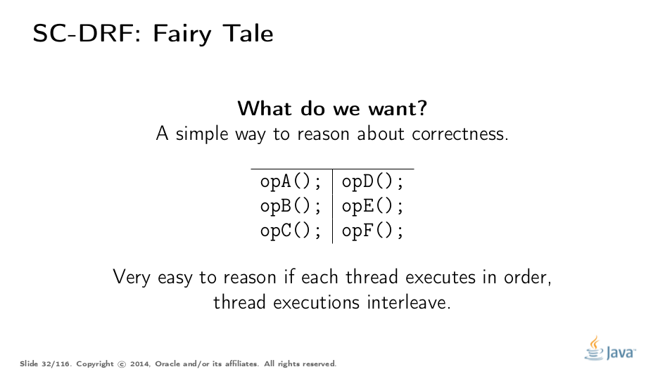

Ahora comenzaremos a revisar una de las partes más interesante del modelo de memoria.Sería lógico que pensemos que los programas ejecutan sus sentencias en un orden global, en donde hay algun switching entre los threads; Podemos ver esto como un modelo muy simple el cual Lamport lo definio como sequential consistency.

---

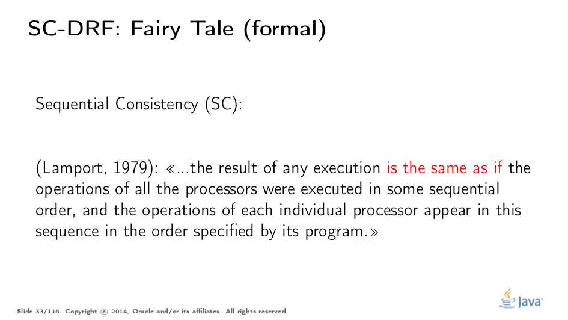

Sequential consistency no quiere decir que las operaciones fueron ejecutadas en un orden total particular!. Es importante que el resultado sea indistinguible de alguna otra ejecuccion con otro orden. Estas ejecuciones se llaman "Sequentially Consistent Executions", y los resultados que obssevamos son llamados "Sequentially Consistent Results"

---

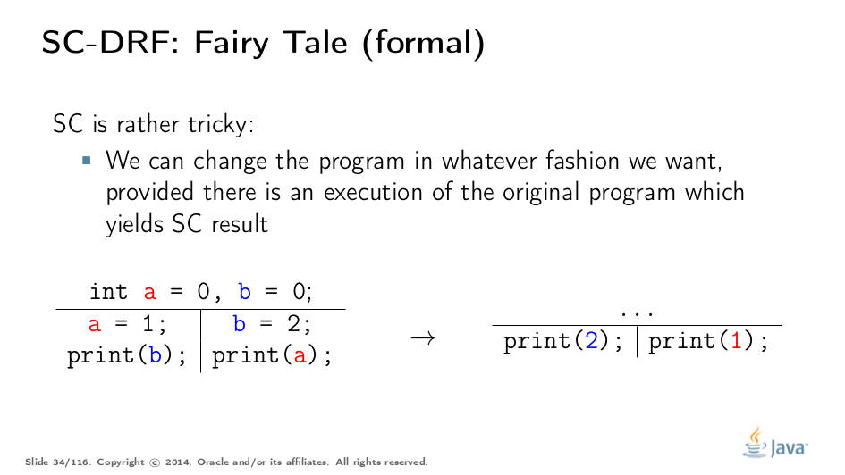

Aparentemente SC nos da la oportunidad de optimizar el codigo. Dado que no estamos restringidos por ningun orden total de ejecucion, solo necesitamos que el resultado sea el mismo y asi podremos hacer distintas optimizaciones. Si tomamos el ejemplo de la imagen podemos ver que la transformacion que realizamos no rompe "Sequentially Consistent", por lo tanto podemos decir que hay SC execution entre el programa original y el optimizado dado que que el resultado es el mismo. (Asumiendo que nadie esta pensando en los valores de a y b)

Ademas SC nos permite reducir el numero de posibles de ejecuciones. Si llevamos esto al extremo, nosotros somos libres de seleccionar un orden simple y utilizar ese.

---

=== ¿Qué tenemos? (What Do We Have)

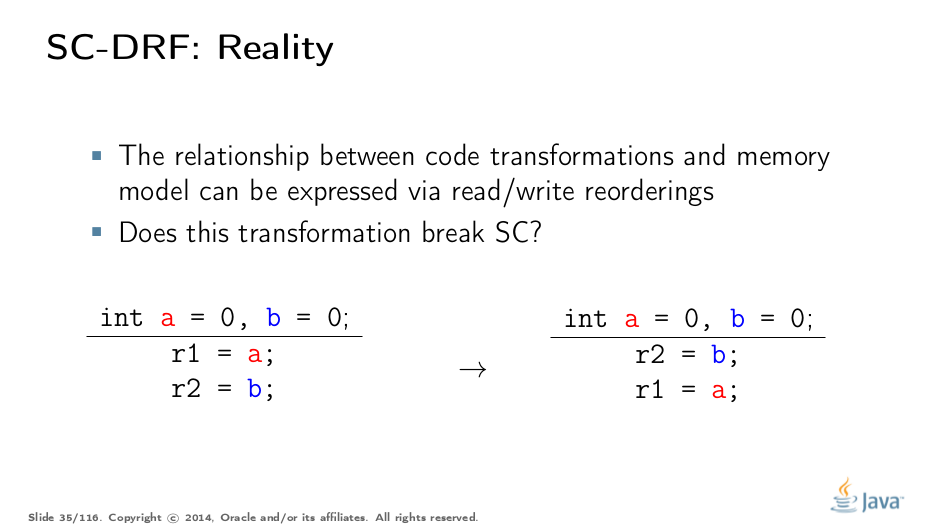

Sin embargo, la optimizacion sobre SC esta sobrevalorada. Debemos notar que los optimizadores de compiladores ,ni hablar del hardware, solo se preocupan del flujo de instrucciones. Entonces si tenemos dos operaciones de read, podemos reordenarlas y mantener SC?

---

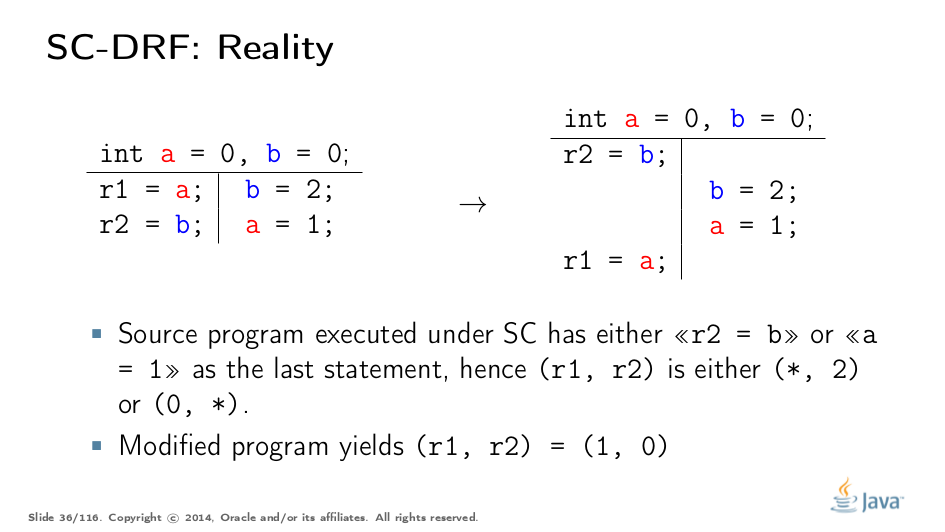

Resulta que no podemos. Debido a que si otra parte de nuestro programa persiste algun valor en "a" y "b",entonces el reordenamiento rompe SC. Efectivamente, el programa original ejecutado bajo SC solo puede emitir resultados del tipo (*, 2) or (0, *), pero si modificamos nuestro programa, aunque lo ejecutemos de forma que se cumpla el total order, puede llevar a resultados del tipo (1, 0) sorprendiendo a los desarrolladores que esperan SC de su codigo.

---

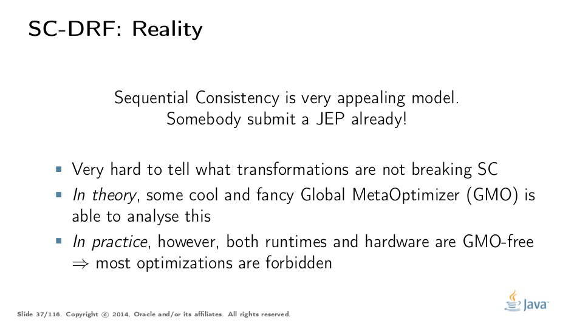

Podemos notar que es muy dificil ver si una simple transformacion es razonable, dado que se necesita un detallado analisis, el cual no escala para programas reales. En teoria, podemos tener un "Smart Global Optimizer" (GMO) que puede realizar este analisis. Aunque el autor considera que la existencia de un GMO esta altamente asociado a la existencia de Laplace’s Demon :).

Pero dado que no tenemos un GMO, todas las optimizaciones son cautelosamente prohibidas por miedo de violar SC y esto es un costo para la performance. Entonces que hacemos? No podemos ir con las transformaciones, correcto? Poco probable, incluso la transformacion mas basica estaria prohibidad. Pensemos acerca de esto, podemos asignar una variable en un registro, si eso efectivamente elimina todas las lecturas en cualquier otra parte del programa. Reordenamiento?

---

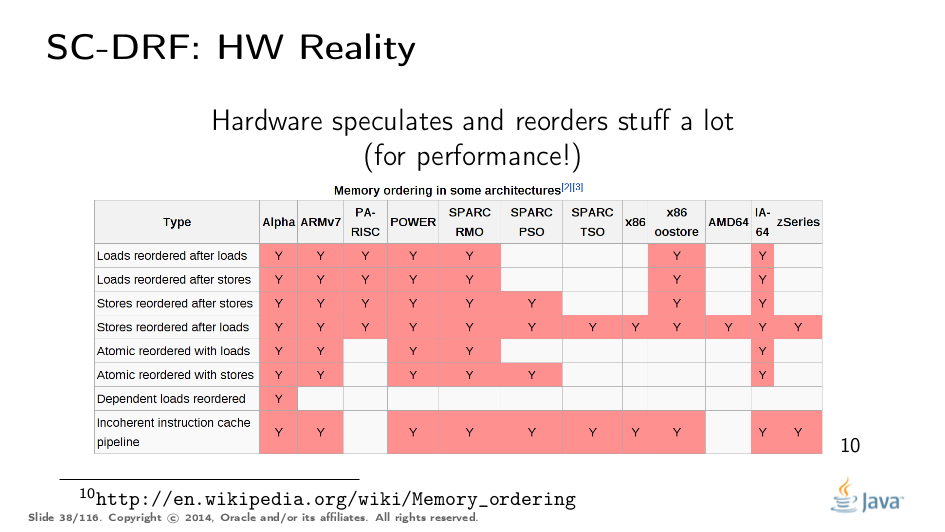

y Mientras podemos prohibir ciertas optimizaciones en los compiladores para evitar
comprometer SC, no debemos olvidarnos que no es tan simple controlar el hardware. El hardware realiza un monton de reordenaciones y provee una forma costosa pero que nos permite evitar reordenamientos ("memory barriers")". Por lo tanto, un modelo que no controla que transformaciones son posibles y que optimizaciones son permitidas no seria realista para ejecutarse con una performance decente. Por ejemplo si es requerido que el lenguaje ofrezca SC, nosotros probablemente deberiamos de forma pesimista emitir "memory barriers" para casi todas las instrucciones que accedan a la memoria, con el fin de eliminar los intentos del hardware por "optimizaciónes".

---

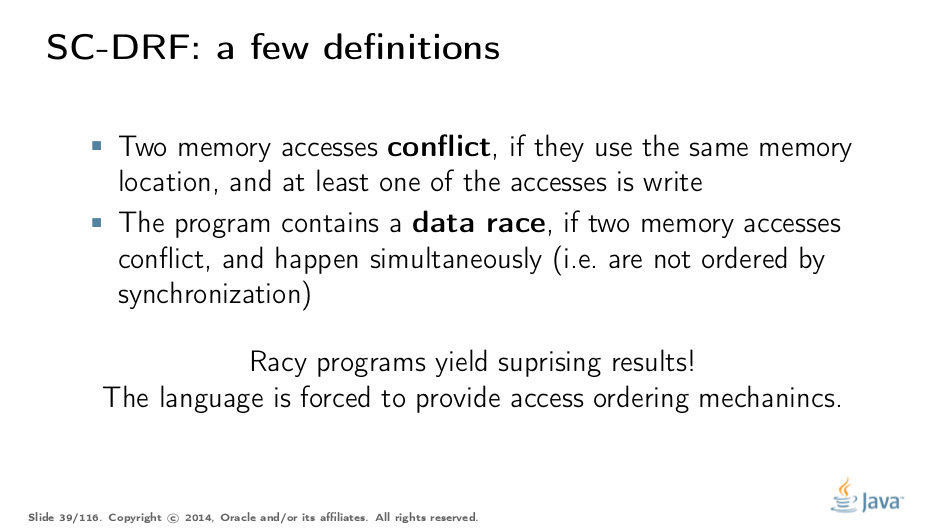

Ademas, si nuestro programa contiene races, el hardware actual no garantiza ningun resultado en particuales al ejecutar esas operaciones conflictuadas.

---

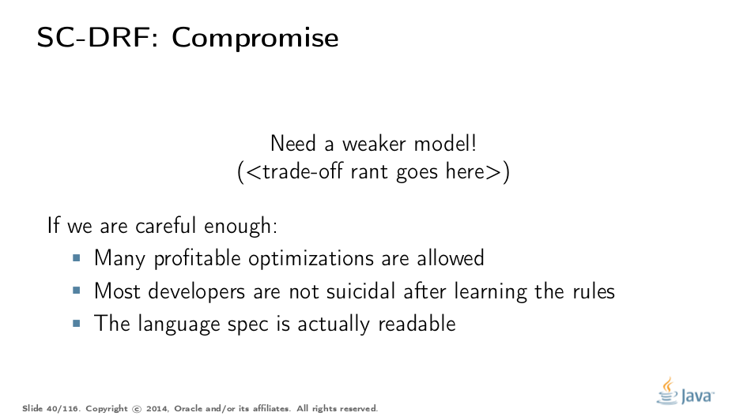

Por lo tanto, para acomodar el modelo a la realidad y obtener un performance aceptable, tenemos que relajar el modelo.

---

=== Java Memory Model

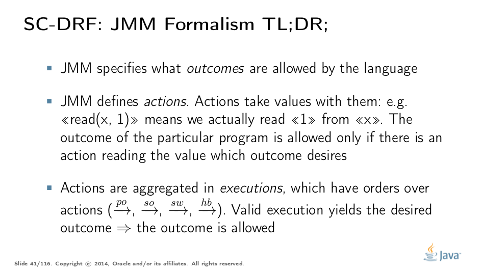

Aqui es donde las cosas se complican. Dado que la especificacion debe cubrir todo los casos pobiles, pero nosotros no podemos proveer un numero finitos de construcciones que estan garantizadas para funcionar. La union de posibilidad dejaria espacios en blanco en la semantica y los espacios no son buenos.

Por lo tanto, el JMM intenta cubrir todas las posibilidades. Esto lo hace describiendo las acciones que un programa puede ejecutar, y esas acciones describen posibles resultados que pueden producir al ejecutar un programa.
Las acciones estan asociadas a las ejecucciones, que combinan las acciones con la definicion del orden que tienen con acciones relacionadas. Esto suena muy "ivory-tower-esque", mejor veamos unos ejemplos

---

==== Program Order (PO)

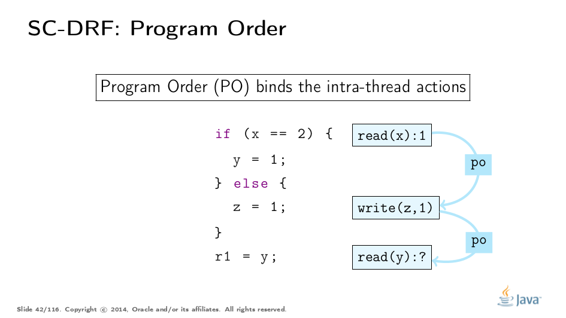

El primer tipo de orden es el Program Order (PO). Ordena las acciones dentro de un thread. Debemos notar el programa original, y una de sus posibles ejecucciones. Aqui, el programa puede leer "1" desde x, ejecutando la rama del else, donde se almacena "1" en z, y luego leer "algun valor" desde y.

---

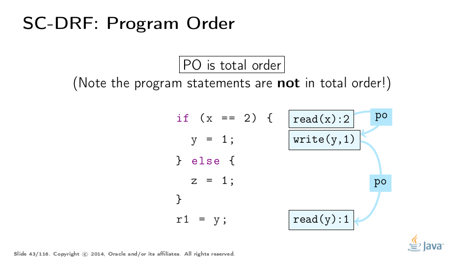

Program order es total (Dentro de un thread), i.e. cada par de acciones esta relacionada por su orden, por lo cual es importante entender algunas cosas.
Las acciones linkeadas entre si en PO no estan imposibilitadas para ser reordenadas. De hecho, es un poco confuso hablar de reordenamiento de acciones, por que uno probablemente intenta hablar de sentencias reordenadas en un programa, lo cual genera nuevas ejecucciones. Entonces sera una pregunta abierta si las ejecucciones generadas por este nuevo programa violan las disposiciones del JMM.

Program order no genera nuevas ejecucciones, y repetimos que no genera garantias de reordenamiento. Solo existe para proveer el link entre posibles ejecucciones y el programa original.

---

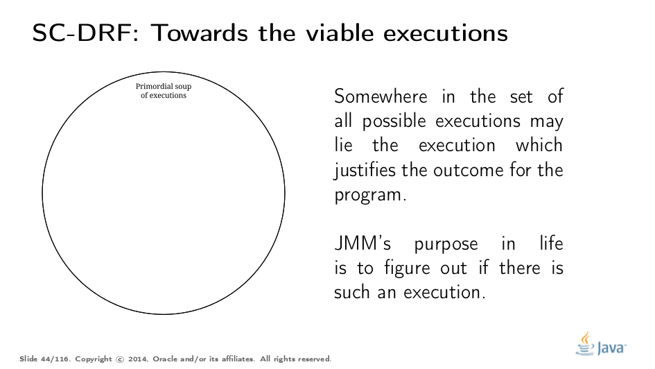

Lo que queremos decir es que dado el simple esquema de acciones y ejecucciones, se pueden construir un infinito numero de ejecucciones. Estas ejecucciones estan desenganchadas de una realidad especifica, solo son el "condimiento primordial", conteniendo todas las construcciones posibles. En algun lado en este grupo se encuentran las ejecucciones que pueden explicar un posible resultado para el programa dado, y el conjunto de todas las posibles ejecucciones cubriendo el grupo de todos los posibles resultados del programa.

---

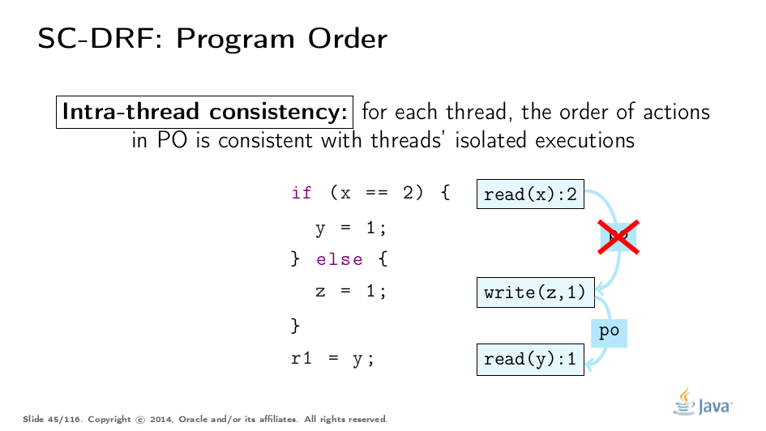

Aqui es donde Program Order (PO) entra en juego. Para filtrar las ejecucciones, podemos razonar acerca de un programa en particular, tenemos la regla de consistencia *intra-thread*, la cual elimina todas las ejecucciones no relacionadas. Por ejemplo, en el ejemplo anterior, mientras que la ilustraccion es posible no refleja el programa original, despues de leer el valor 2 desde x, en ese caso debemos escribir 1 a y no en z.

---

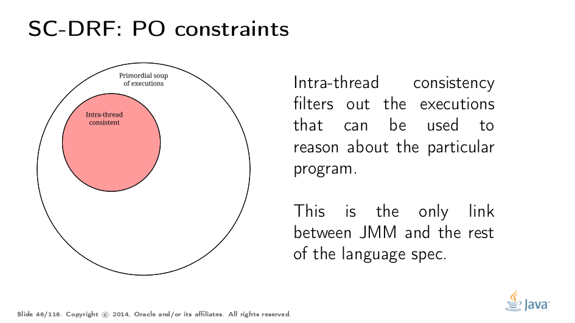

Aqui tenemos una ilustraccion del filtro aplicado. La consistencia Intra-thread es el primer filtro de ejecucciones, esto es lo que la mayoria de las personas hacen de forma implicita en sus cabezas cuando se lidia con el JMM. A este punto se puede notar que el JMM no es un modelo constructivo: No construimos la solucion de forma inductiva, pero en su lugar tomamos el conjunto entero de ejecucciones y filtramos aquellas que son interesantes para nosotros.

---

==== Synchronization Order

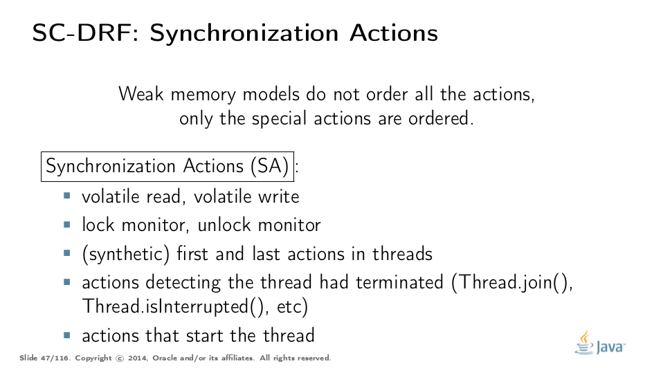

Ahora empezamos a construir partes del modelo que realmente ordenan cosas. En un modelo de memoria relajado, nosotros no ordenamos todas las acciones, solo imponemos un orden en un conjunto limitado de primitivas. En el JMM, esas primitivas son encapsuladas en sus respectivas acciones "Synchronization Actions".

---

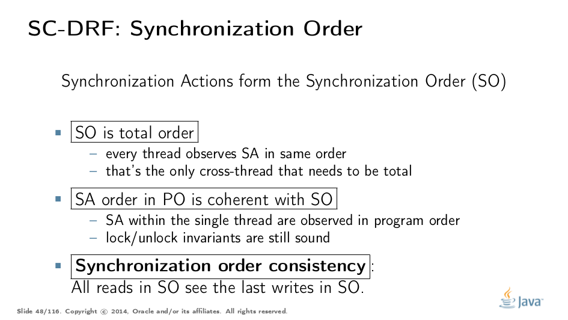

Synchronization Order (SO) es total orden dentro del conjunto de todas las Synchronization Actions, aunque esto no es lo mas interesante de este orden. El JMM provee dos limitantes adicionales:
* Consistencia SO-PO
* Consistencia SO

Veamos esto con un ejemplo trivial.

---

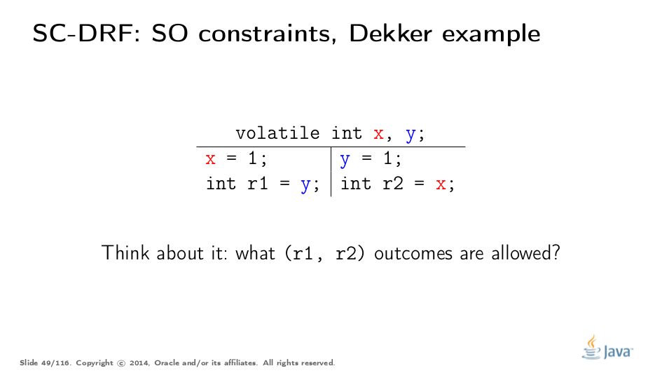

Este es un ejemplo simple derivado de "Dekker Lock". Intentemos pensar en los posibles resultados
posibles y el por que de ellos. Luego, analizaremos esto en el JMM.

---

Las slides a continuacion son auto-explicativas, y simplemente las saltearemos:

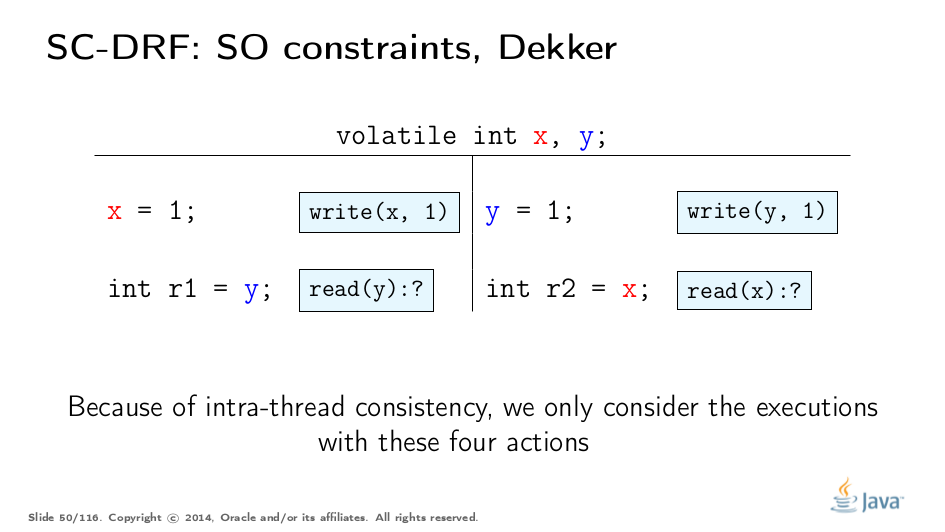

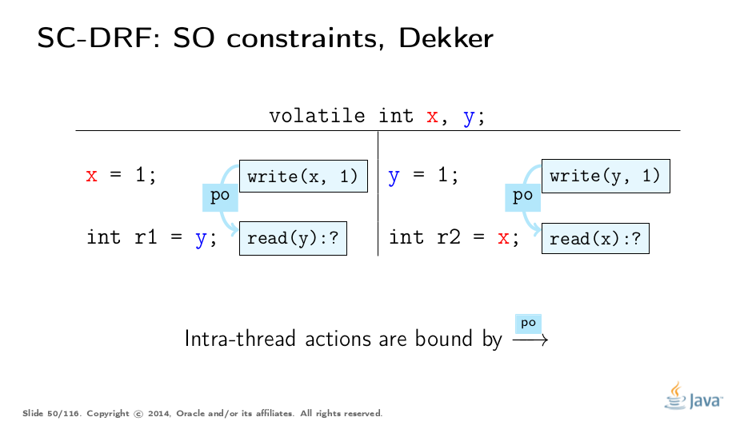

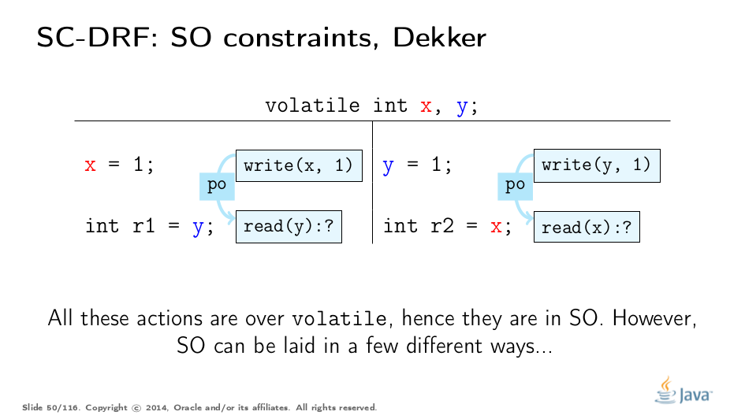

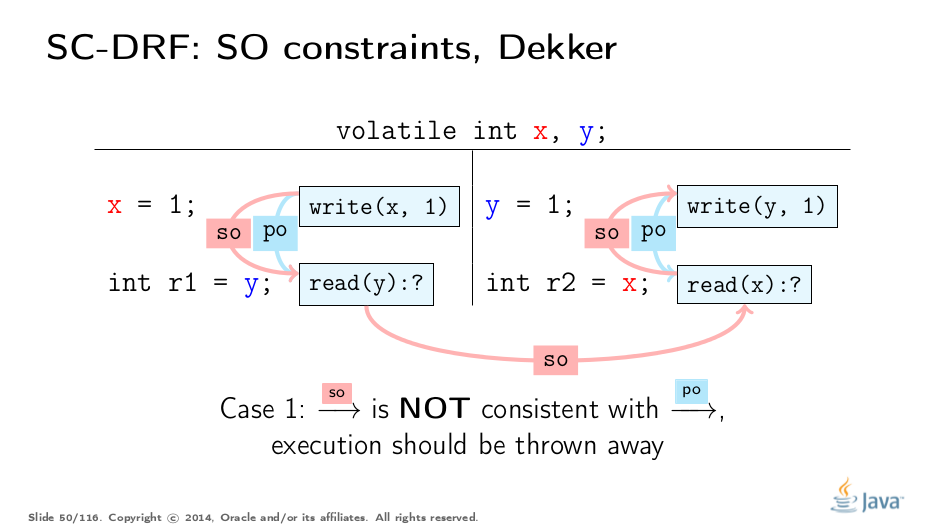

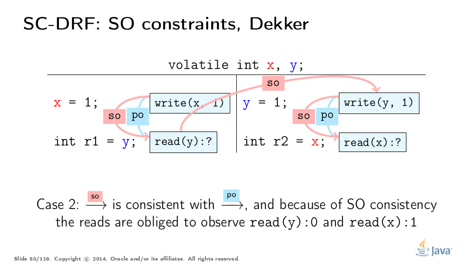

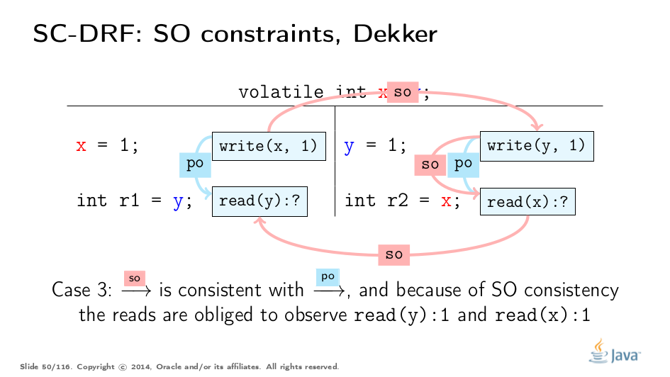

---

Ahora si prestamos atencion a estas reglas, notaremos una interesante propiedad. La SO-PO consistency nos indica que los efectos de SO son visibles como si las acciones fueran realizadas en Program Order.

La SO consistency nos indica observar todas las acciones precedentes en el SO, incluso aquellas que ocurrieron en un thread diferente. Esto es como si SO-PO consistency nos indicara para seguir el programa, y SO consistency nos permite hacer switch entre los threads, arrastrando todos los efectos. Mezclado con la totalidad de SO, llegamos a una regla interesante:

---

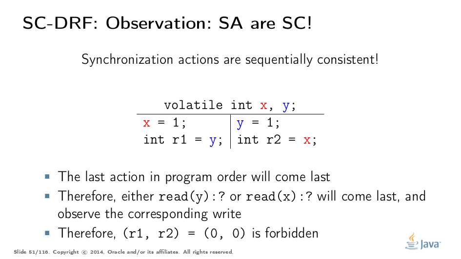

Synchronization Actions son secuencialmente consistente. En un programa formado por variable volatiles, podemos razonar acerca del resultado sin analizar demasiado en profundidad. Dado que SAs son secuencialmente consistente, podemos construir todas las intercalaciones de acciones y descubrir los posibles resultados desde ahi. Debemos notar que aun no hay un "happens-before"; entonces SO es suficiente para el razonamiento.

---

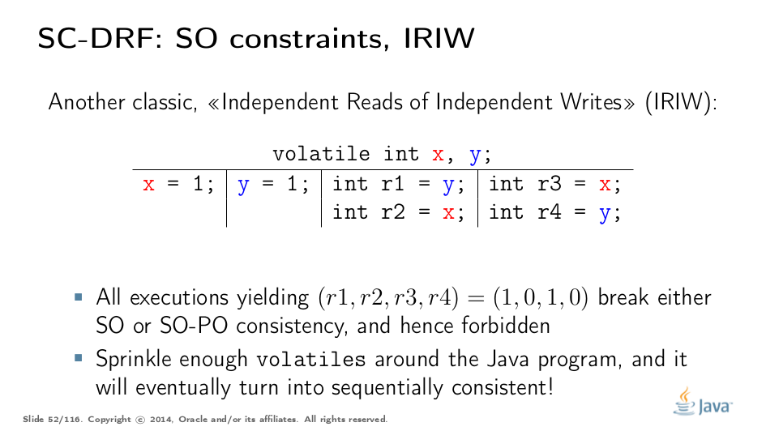

IRIW is another good example of SO properties. Again, all operations yield synchronization actions. The outcomes may be generated by enumerating all the interleavings of program statements. Only a single quad is forbidden by that construction, as if we observed the writes of x and y in different orders in different threads.

The real takeaway was best summed up by Hans Boehm. If you take an arbitrary program, no matter how many races it contains, and sprinkle enough volatile-s around that program, it will eventually become sequentially consistent, i.e. all the outcomes of the program would be explained by some SC execution. This is because you will eventually hit a critical moment when all the important program actions turn into synchronization actions, and become totally ordered.

---

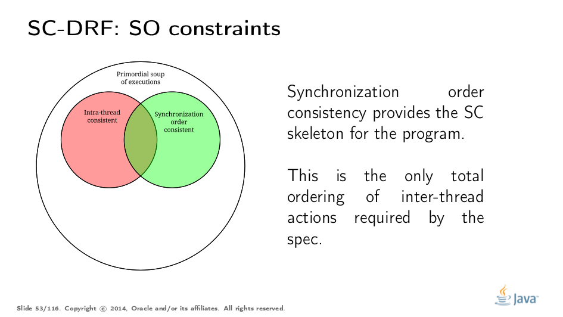

To conclude with our Venn diagram, SO consistencies filter out the executions with broken synchronization "skeletons". The outcomes of all the remaining executions can be explained by program-order-consistent interleavings of synchronization actions.

---

==== Happens-Before

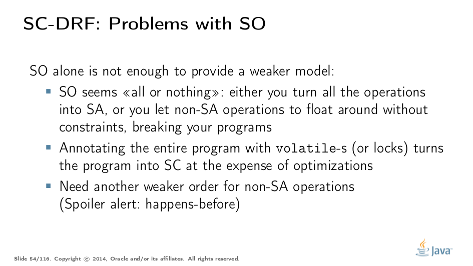

SO provee una forma basica para razonar acerca de los posibles resultado, pero SO no es suficiente para construir un weak model. Aqui esta el porque.

---

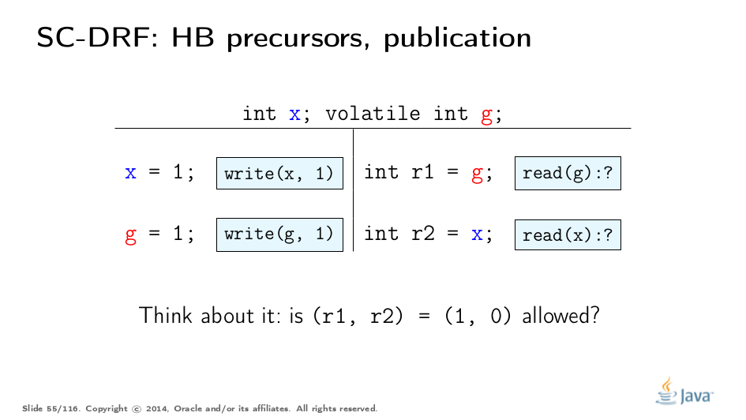

Analizemos este simple caso. Dado todo lo que aprendimos hasta aca acerca de SO, es posible obtener como resultado (1, 0)?

---

image::images/jmm/055.png[]

Veamos. Dado que SO solo ordena acciones sobre g, nada previene que leamos 0 o 1 desde x.Lo cual es malo!.

---

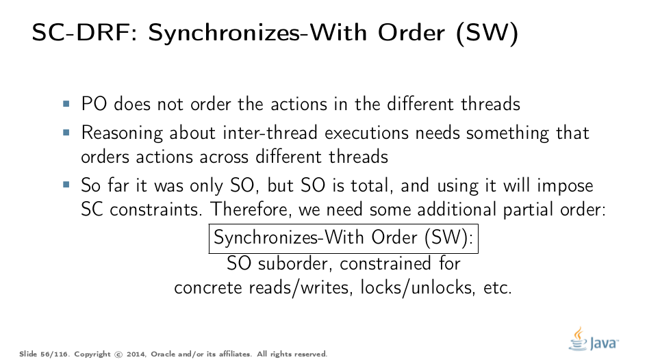

Necesitamos algo para conectar el estado de los threads, algo que nos permita manejar las non-SA. SO no es usado para esto, porque no es claro cuando y como manejar el estado. Por lo cual, necesitamos un sub-orden bien definido de SO que describa el data flow. Esto es llamado synchronizes-with order (SW).

---

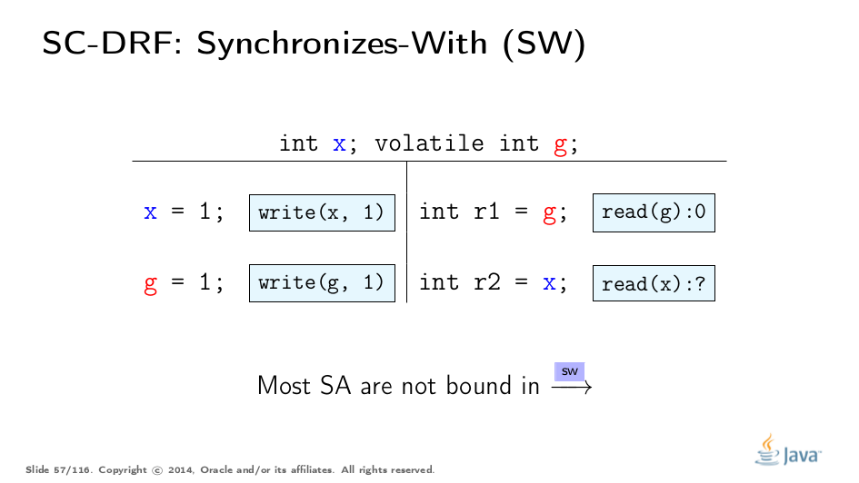

Es facil construir acciones SW. SW es orden parcial, y no se expande a todos los pares de SA. Por ejemplo aunque las dos operaciones sobre g son SO, ellas no son SW.

---

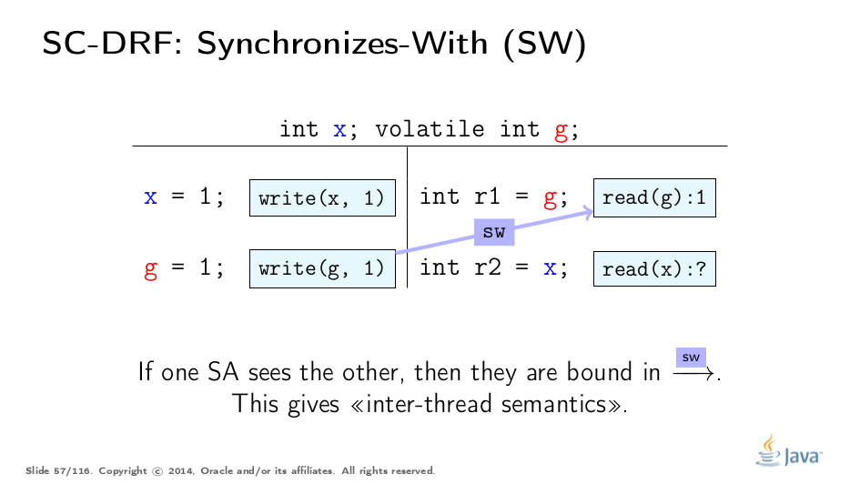

SW solo juntas los pares de acciones especificas las cuales se "ven" unas a las otras. Mas formalmente el write sobre g "synchronizes-with" todos los subsiguientes reads en g. Subsiguiente es definido en terminos de SO, y por lo tanto en base a la SO consistency, el write de "1" solo se sincroniza con la lectura de "1". En este ejemplo vemos el SW entre las acciones. Este suborden nos brinda el "bridge" entre threads, pero aplicado a SA. Extendamos esto a otras acciones.

---

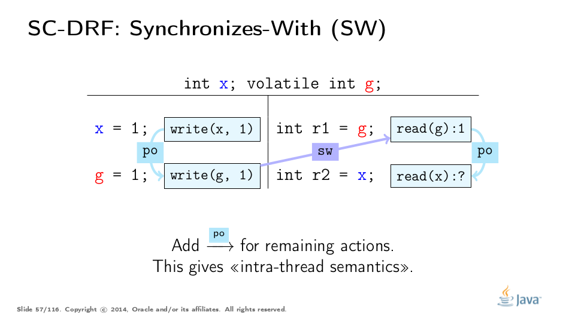

La semantica Intra-thread es descripta por el Program Order.

---

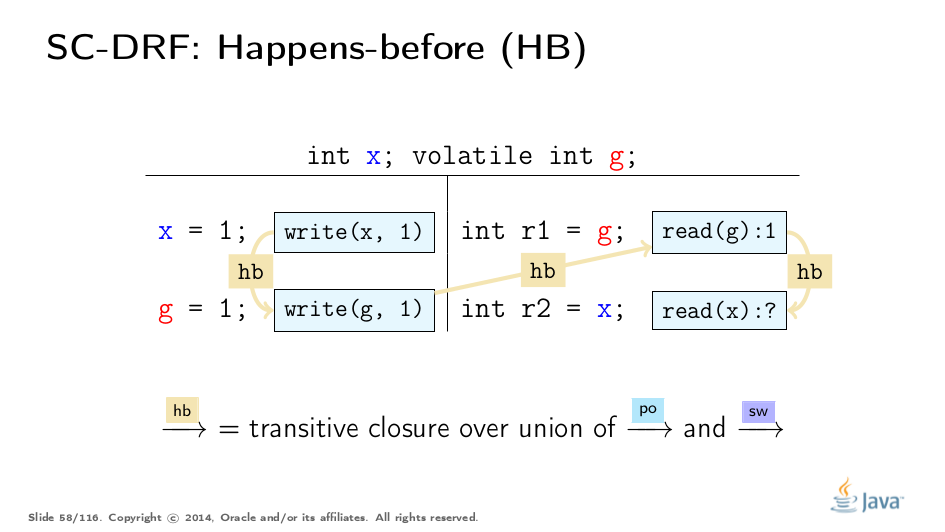

Ahora, si construimos la union entre PO y SW, y luego cerramos esa union, obtenemos el orden derivado: Happens-Before (HB). HB en este sentido adquiere ambas semanticas Inter-Thread y Intra-Thread. PO pierde la informacion acerca de las sequential actions en cada thread en HB y SW, estas son perdidas cuando el estado se sincroniza. HB es orden parcial, y nos permite la construccion de ejecucciones equivalentes con reordenamientos de acciones.

---

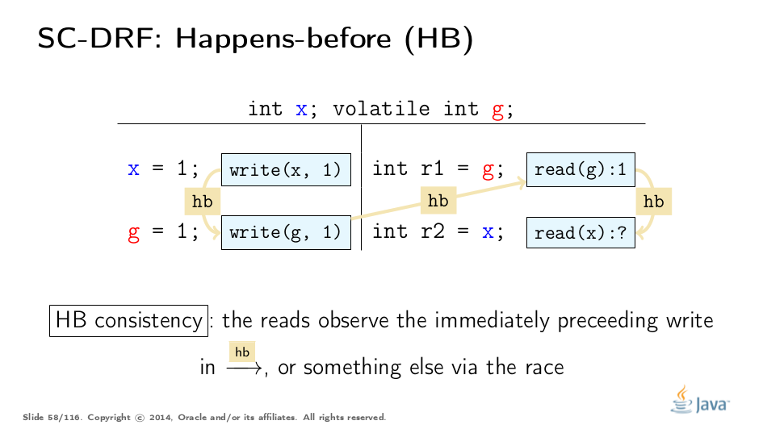

Happen-before viene con otra regla de consistencia. Si recordamos la regla de SO consistency, que establece que la sincronizacion de acciones debe ver el ultimo write en SO. La consistencia de Happens-before es similar aplicada al orden del tipo HB. Esto dicta que los writes pueden ser observados por cualquier read en particular.

---

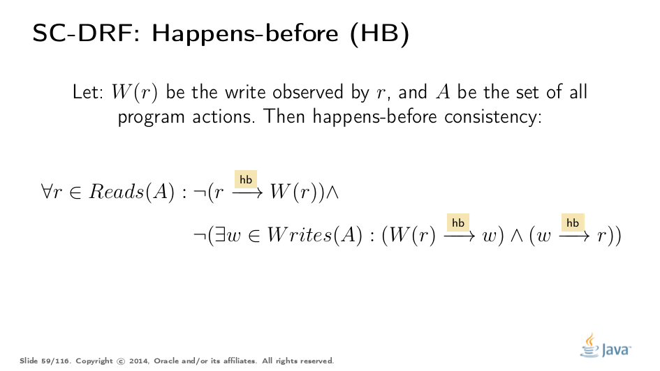

La consistencia HB es interesante en permitir "races". Cuando no hay "races" presentes, solo podemos ver el ultimo write en HB. Pero si tenemos un unordered write en HB que respecta a un cierto read, entonces podemos ver ese "racy" write. Definamos esto de forma mas rigurosa.

---

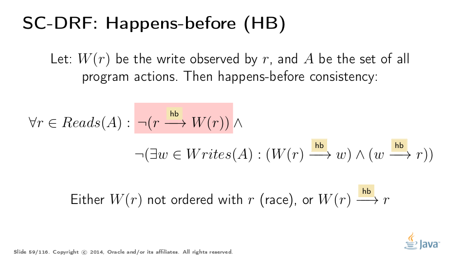

La primer parte es bastante simple: Podemos observar los write que pasaron antes que nosotros, o cualquier otro unordered write. Esta es una propiedad muy importante del modelo: nosotros especificamente permitimos "races", porque "races" suceden en el mundo real. Si estos fueran prohibidos, los runtimes tendrian una tarea muy complicada optimizando el codigo porque ellos necesitarian forzar el orden en todos lados.
Notemos como esto nos elimina la posibilidad de ver writes ordenados luego de leer en HB orden.

---

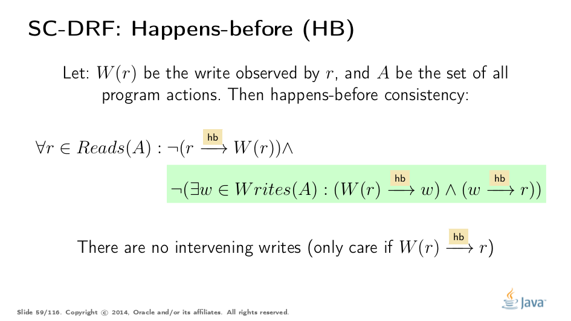

La segunda parte agregar algunas restricciones adicionales sobre la visibilidad de los write anteriores: Solo podemos ver el ultimo write en HB orden. Cualquier otro write anterior es invisible para nosotros. Por lo tanto, en la ausencia de "races", solo podemos ver el ultimo write en HB.

---

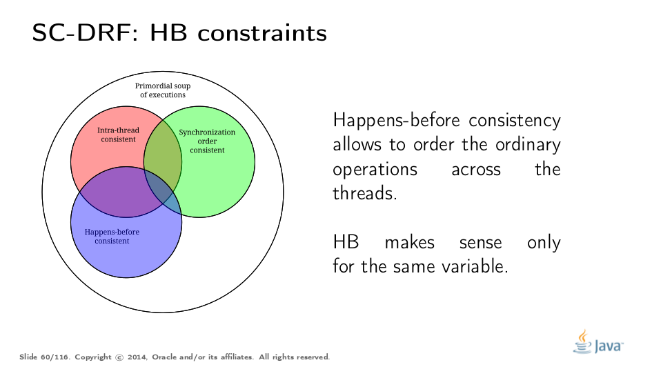

La consecuencia de la consistencia de HB es para filtrar otro subset de ejecucciones que observan algo que esta permitido de ser observado. HB se extiende sobre las acciones "non-synchronized", y por lo tanto deja al modelo adoptar todas las acciones en sus ejecucciones.

---

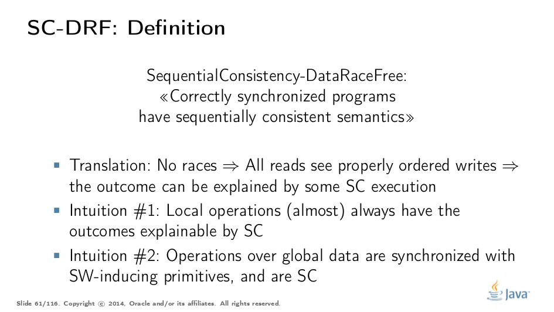

Todo esto es acerca de SC-DRF: Si no tenemos "races" en nuestro programa, todos los reads y writes son ordenados por SO o HB, por lo cual el resultado puede ser explicado por algun tipo de ejecuccion que sea sequentially consistent. Hay una prueba forma de las propiedades de SC-DRF, pero vamos a usar entendimiento intuitivo de por que esto debe ser cierto.

---

==== Happens-Before: Publication

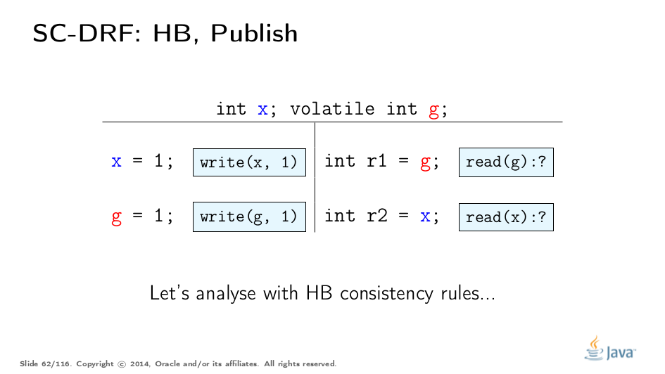

The examples above were rather highbrow, but that is how language spec is defined. Let’s look at the example to understand this more intuitively. Take the same code example, and analyze it with HB consistency rules.
